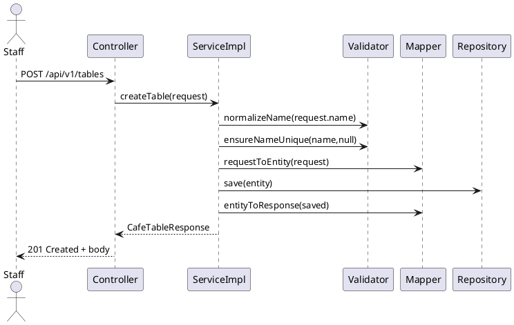

# Module Bàn (CaféTable)

> Trạng thái: **Hoàn thiện** – service tách interface/impl, validator riêng, test unit đầy đủ.

## 1. Mục tiêu & Phạm vi
- Quản lý danh sách bàn trong quán: tạo, cập nhật thông tin, đổi trạng thái, xoá.
- Đảm bảo tên bàn duy nhất, trạng thái hợp lệ, không xoá khi còn đơn hàng liên quan.
- Cung cấp API REST phục vụ frontoffice/backoffice theo contract sẵn có.

## 2. Kiến trúc tổng quan
```
controller.CafeTableController
        │
        ▼
service.CafeTableService (interface)
        │
        ▼
service.impl.CafeTableServiceImpl
        ├── CafeTableRepository
        ├── CafeTableMapper (MapStruct)
        └── CafeTableValidator (helper)
```
- `CafeTableServiceImpl` chịu trách nhiệm orchestration, logging, transaction.
- `CafeTableValidator` gom toàn bộ kiểm tra nghiệp vụ (normalize tên, parse trạng thái, kiểm tra đang được sử dụng).
- `CafeTableMapper` map entity ↔ DTO, chuẩn hóa `status` sang chuỗi.
- Exception chuẩn hóa theo `BusinessException`: `CafeTableNotFoundException`, `CafeTableConflictException`, `CafeTableValidationException`, `CafeTableDeletionNotAllowedException`.

## 3. Luồng chính


## 4. API giữ nguyên contract
| HTTP | Đường dẫn | Mô tả | Quyền |
|------|-----------|-------|-------|
| GET | `/api/v1/tables` | Lấy danh sách bàn | STAFF/MANAGER/ADMIN |
| GET | `/api/v1/tables/{id}` | Lấy chi tiết bàn | STAFF/MANAGER/ADMIN |
| POST | `/api/v1/tables` | Tạo bàn mới từ `CafeTableRequest` | MANAGER/ADMIN |
| PUT | `/api/v1/tables/{id}` | Cập nhật thông tin bàn | MANAGER/ADMIN |
| PATCH | `/api/v1/tables/{id}/status` | Đổi trạng thái bàn, nhận JSON `{ "status": "SERVING" }` | STAFF/MANAGER/ADMIN |
| DELETE | `/api/v1/tables/{id}` | Xoá bàn khi không còn đơn hàng | MANAGER/ADMIN |

## 5. DTO & Entity
- `CafeTableRequest`
  - `name` (`@NotBlank`)
  - `capacity` (`@Min(1)`)
- `CafeTableResponse`
  - `id`, `name`, `capacity`, `status` (chuỗi enum `TableStatus`).
- `CafeTable` entity
  - Trạng thái mặc định `EMPTY`.
  - Tên unique, capacity bắt buộc.

Ví dụ response:
```json
{
  "id": 12,
  "name": "Ban Tầng 1",
  "capacity": 4,
  "status": "RESERVED"
}
```

## 6. Validator & Quy tắc nghiệp vụ
- `normalizeName`: trim, gom dấu cách, yêu cầu khác rỗng.
- `ensureNameUnique`: chặn trùng tên (case-sensitive sau normalize) với bàn khác.
- `parseStatus`: chỉ cho phép `EMPTY`, `SERVING`, `RESERVED`, `PENDING`, `AVAILABLE`.
- `ensureTableDeletable`: dùng `OrderRepository.countByCafeTableId`, không cho xoá khi >0 đơn hàng.

## 7. Exception mapping
| Exception | HTTP | Khi nào |
|-----------|------|--------|
| `CafeTableNotFoundException` | 404 | Không tìm thấy bàn theo id |
| `CafeTableConflictException` | 409 | Tên bàn trùng |
| `CafeTableValidationException` | 400 | Payload/Trạng thái không hợp lệ |
| `CafeTableDeletionNotAllowedException` | 409 | Còn đơn hàng liên quan |

## 8. Kiểm thử
- `CafeTableServiceTest` (Mockito): cover tạo bàn, cập nhật, đổi trạng thái, xoá, propagate exception.
- `./mvnw -q -Dtest=CafeTableServiceTest test` & `./mvnw clean test` pass sau cập nhật.

## 9. Checklist hoàn tất
- [x] Service tách interface/impl, helper validator riêng.
- [x] Chuẩn hóa mapper trả `status` dạng chuỗi.
- [x] Exception domain riêng, dùng chung `BusinessException`.
- [x] Controller giữ nguyên contract, chỉ cập nhật import.
- [x] Unit test mới cho service.
- [x] Tài liệu tiếng Việt (file này).

---
**Hoàn thành: 100%**
