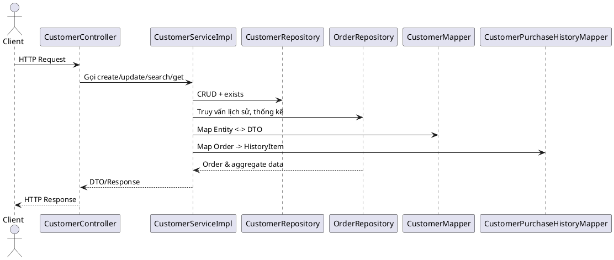

# Module Customer – Tài liệu refactor

## 1. Tổng quan
- Mục tiêu: Chuẩn hoá service quản lý khách hàng (Customer) theo chuẩn clean code, SOLID, exception hoá rõ ràng và đảm bảo giữ nguyên contract API hiện có.
- Thành phần chính: `CustomerController`, `CustomerService` (interface), `CustomerServiceImpl`, `CustomerRepository`, `OrderRepository` (phần thống kê), `CustomerMapper`, `CustomerPurchaseHistoryMapper`, DTO và các exception mới.

## 2. Kiến trúc & luồng chính

## 3. API giữ nguyên hợp đồng
| Method | Endpoint | Vai trò | Ghi chú |
|--------|----------|---------|--------|
| POST | `/api/v1/customers` | Tạo khách hàng | Trả `CustomerDTO`, HTTP 201. |
| GET | `/api/v1/customers` | Tìm kiếm phân trang | Filter theo keyword (fullName/phone). |
| GET | `/api/v1/customers/{id}` | Chi tiết khách hàng | Throw `CustomerNotFoundException` nếu không tồn tại. |
| GET | `/api/v1/customers/phone/{phone}` | Tìm theo số điện thoại | Trả `CustomerDTO`. |
| GET | `/api/v1/customers/{id}/purchase-history` | Lịch sử mua hàng | Trả `CustomerPurchaseHistoryResponseDTO`. |
| PUT | `/api/v1/customers/{id}` | Cập nhật | Giữ nguyên loyaltyPoints. |
| DELETE | `/api/v1/customers/{id}` | Xoá | Chặn xoá nếu còn order (`CustomerDeletionNotAllowedException`). |

## 4. Điểm refactor nổi bật
- `CustomerService` tách interface + `CustomerServiceImpl` với `@Transactional(readOnly = true)` mặc định, method ghi đè tự set read-write.
- Thêm helper `findCustomerById`, `validateUniquePhone/email`, `ensureCustomerHasNoOrders` để giảm lặp và điều kiện lồng nhau.
- Chuẩn hoá tính điểm loyalty bằng hằng số `FIRST/SECOND/THIRD_TIER_THRESHOLD`.
- `buildHistoryItems` + `fetchOrders` gom logic xử lý đơn hàng và giữ thứ tự ID.
- Logging ngắn gọn cho hành động chính (create/update/delete, cộng điểm).

## 5. Exception hoá
- `CustomerNotFoundException`: hỗ trợ theo id hoặc field.
- `CustomerPhoneAlreadyExistsException`, `CustomerEmailAlreadyExistsException`: phát hiện trùng dữ liệu, trả HTTP 409.
- `CustomerDeletionNotAllowedException`: chặn xoá khách còn order.

## 6. Validation & nghiệp vụ
- Phone/email kiểm tra uniqueness qua repository; validation chỉ ném exception nếu khác khách hiện tại.
- Loyalty points chỉ cộng nếu hoá đơn > 0 và vượt ngưỡng.
- Khi xoá khách, kiểm tra tồn tại order bằng truy vấn phân trang 1 phần tử.

## 7. Mapper & DTO
- `CustomerMapper` giữ nguyên: map DTO ↔ entity, bỏ qua loyaltyPoints/createdAt/updatedAt khi update.
- DTO không đổi contract, thêm validation phù hợp (phone pattern).

## 8. Repository & truy vấn
- `OrderRepository` tiếp tục cung cấp `findCustomerOrderIds`, `findCustomerOrdersByIds`, `calculateCustomerPurchaseAggregate`.
- Truy vấn lịch sử sử dụng `Page<Long>` để giảm tải và lấy chi tiết bằng fetch join.

## 9. Test & gợi ý mở rộng
- Hiện chưa có test riêng cho `CustomerServiceImpl`; khuyến khích bổ sung unit test kế tiếp.
- Khi mở rộng loyalty (ví dụ tier nâng cấp), cập nhật `calculatePoints` và hằng số.

## 10. Checklist hoàn thành
- [x] Tách interface/impl.
- [x] Chuẩn hoá exception & validation.
- [x] Viết helper rõ ràng, giảm lặp.
- [x] Viết tài liệu tiếng Việt.

---
**Hoàn thành:** 100%
