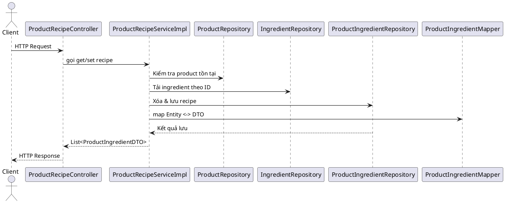

# Module Product Recipe – Tài liệu refactor

## 1. Tổng quan
- Mục tiêu: chuẩn hoá luồng quản lý định lượng sản phẩm (recipe), đảm bảo validation rõ ràng, exception hoá đầy đủ và giữ nguyên hợp đồng API.
- Thành phần chính: `ProductRecipeController`, `ProductRecipeService` (interface), `ProductRecipeServiceImpl`, `ProductIngredientMapper`, `ProductIngredientRepository`, `ProductRepository`, `IngredientRepository`, các DTO liên quan và exception mới.

## 2. Kiến trúc & luồng xử lý

## 3. API giữ nguyên
| Method | Endpoint | Vai trò | Ghi chú |
|--------|----------|---------|--------|
| GET | `/api/v1/products/{productId}/recipe` | Lấy công thức | Trả danh sách `ProductIngredientDTO`. |
| PUT | `/api/v1/products/{productId}/recipe` | Ghi đè công thức | Nhận `ProductRecipeDTO`, trả danh sách đã lưu. |

## 4. Validation & nghiệp vụ
- Recipe phải có ít nhất một nguyên liệu (`ProductRecipeEmptyException`).
- Mỗi item phải cung cấp `ingredientId` không null.
- Loại bỏ trùng lặp ingredient trong cùng recipe (`ProductRecipeInvalidIngredientException`).
- Kiểm tra tồn tại của từng ingredient (`IngredientNotFoundException`).
- Giữ nguyên logic xoá toàn bộ công thức cũ trước khi insert mới.

## 5. Exception hoá
- `ProductNotFoundException`: product không tồn tại.
- `ProductRecipeEmptyException`: recipe rỗng.
- `ProductRecipeInvalidIngredientException`: ingredient thiếu hoặc trùng.
- `IngredientNotFoundException`: ingredient không tồn tại.

## 6. Mapper & DTO
- `ProductIngredientMapper` dùng MapStruct (disable builder) để map DTO ↔ entity, tránh set product/ingredient trực tiếp.
- DTO giữ nguyên hợp đồng, field hiển thị (name/unit) chỉ dùng ở response.

## 7. Repository & truy vấn
- `ProductIngredientRepository.deleteByProductId` dùng trước khi `saveAll` để đảm bảo data sạch.
- `fetchIngredients` tải toàn bộ ID cần thiết trong một truy vấn, kiểm tra thiếu sót.

## 8. Test & mở rộng
- Hiện chưa có unit test chuyên biệt; khuyến nghị bổ sung khi mở rộng nghiệp vụ.
- Khi thêm logic mới (ví dụ định lượng theo size), nên mở rộng DTO + helper tương ứng.

## 9. Checklist
- [x] Tách interface/implementation.
- [x] Chuẩn hoá validation & exception.
- [x] Tái sử dụng mapper, tránh code lặp.
- [x] Viết tài liệu tiếng Việt.

---
**Hoàn thành:** 100%
