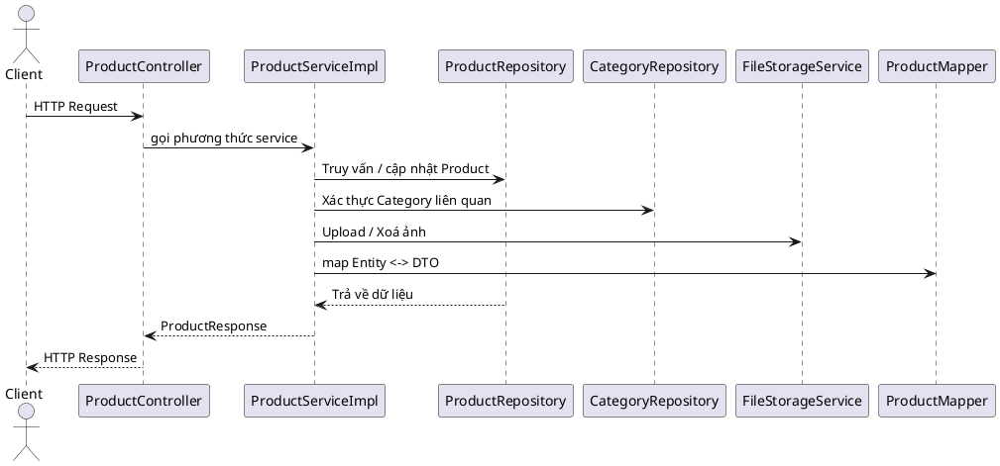

# Module Products – Tài liệu refactor

## 1. Tổng quan
- Mục tiêu refactor: chuẩn hoá kiến trúc, tách interface/implementation, kiểm soát ngoại lệ rõ ràng và đảm bảo module vẫn giữ nguyên hợp đồng API hiện hành.
- Thành phần chính: `ProductController`, `ProductService` (interface), `ProductServiceImpl`, `ProductMapper`, `ProductRepository`, `CategoryRepository`, các exception con và file storage service.

## 2. Kiến trúc & luồng xử lý chính

## 3. API giữ nguyên hợp đồng
| Method | Endpoint | Vai trò | Ghi chú |
|--------|----------|---------|--------|
| POST | `/api/v1/products` | Tạo sản phẩm | Nhận `ProductRequest`, trả `ProductResponse`. |
| GET | `/api/v1/products` | Liệt kê/lọc | Hỗ trợ filter `name`, `categoryId`, phân trang. |
| GET | `/api/v1/products/{id}` | Chi tiết | Throw `ProductNotFoundException` khi không tồn tại. |
| PUT | `/api/v1/products/{id}` | Cập nhật | Giữ nguyên contract, thêm validation code trùng. |
| DELETE | `/api/v1/products/{id}` | Xoá | Chặn xoá khi có order detail. |
| PATCH | `/api/v1/products/{id}/toggle-availability` | Đổi trạng thái | Chỉ flip trường `isAvailable`. |
| POST (multipart) | `/api/v1/products` | Tạo kèm ảnh | Parser JSON + file. |
| PUT (multipart) | `/api/v1/products/{id}` | Cập nhật kèm ảnh | Gộp logic xử lý ảnh. |
| DELETE | `/api/v1/products/{id}/image` | Xoá ảnh | Trả `ProductResponse` với `imageUrl=null`. |
| POST | `/api/v1/products/{id}/image` | Upload ảnh | Yêu cầu file hợp lệ. |

## 4. Chuẩn hoá validation & nghiệp vụ
- Chuẩn hoá normalize mã sản phẩm thông qua `normalizeProductCode` (trim + uppercase, throw `InvalidProductDataException` nếu rỗng).
- `ensureProductCodeUnique` sử dụng `ProductRepository.findByCode` để tránh đụng độ.
- Filter `categoryId` xác thực tồn tại trước khi truy vấn (`ensureCategoryExists`).
- Các thao tác ảnh dùng helper `storeImage`, `replaceImage`, `deleteImageFile` để đảm bảo không lặp.

## 5. Exception hoá
- `ProductNotFoundException`: NOT_FOUND khi không tìm được sản phẩm.
- `ProductCodeAlreadyExistsException`: BAD_REQUEST khi mã trùng.
- `ProductDeletionNotAllowedException`: BAD_REQUEST khi sản phẩm đang được tham chiếu order.
- `InvalidProductDataException`: BAD_REQUEST cho dữ liệu thiếu/hỏng.
- `CategoryNotFoundException`: NOT_FOUND khi danh mục không hợp lệ.

## 6. Mapper & DTO
- `ProductMapper` dùng MapStruct, ignore `isAvailable`, `imageUrl`, `createdAt`, `updatedAt` để tránh ghi đè.
- `ProductRequest`/`ProductResponse` không đổi contract.

## 7. Repository & truy vấn
- `ProductRepository` bổ sung `findByCode` phục vụ kiểm tra uniqueness.
- Mọi truy vấn filter sử dụng `Specification<Product>` với Predicate linh hoạt.

## 8. Test bao phủ
- `ProductServiceTest` cập nhật dùng `ProductServiceImpl` và các exception mới.
- Đảm bảo kiểm tra normalize code, validation rỗng và map kết quả.
- Cần chạy lại toàn bộ suite (`./mvnw clean test`) sau khi chỉnh MapStruct.

## 9. Hướng dẫn mở rộng
- Khi thêm thuộc tính sản phẩm mới, hãy cập nhật mapper và DTO tương ứng.
- Nếu thêm tiêu chí filter, mở rộng `buildProductSpecification`.
- Các quy tắc nghiệp vụ mới nên đóng gói bằng helper riêng để giữ service gọn.

## 10. Checklist hoàn thành
- [x] Tách interface/impl.
- [x] Chuẩn hoá exception & logging.
- [x] Refactor xử lý ảnh.
- [x] Cập nhật unit test.
- [x] Viết tài liệu tiếng Việt.

---
**Hoàn thành:** 100%
