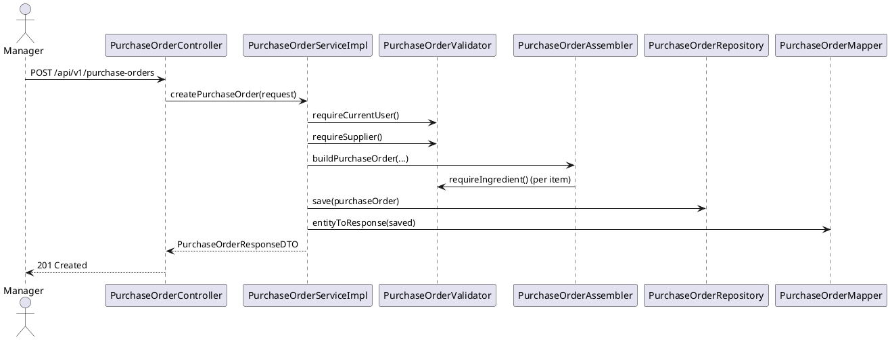

# Module Phiếu nhập hàng (Purchase Order)

> Trạng thái: **Hoàn thiện** – service tách interface/impl, validator & assembler riêng, exception chuẩn hóa, unit test đầy đủ.

## 1. Mục tiêu & Phạm vi
- Quản lý quy trình tạo, xem, hoàn tất, huỷ phiếu nhập hàng.
- Đảm bảo dữ liệu nhà cung cấp, nguyên liệu và nhân sự hợp lệ; cập nhật tồn kho chính xác khi hoàn tất.
- Giữ nguyên contract API REST hiện dùng cho backoffice.

## 2. Kiến trúc tổng quan
```
controller.PurchaseOrderController
        │
        ▼
service.purchaseorder.PurchaseOrderService (interface)
        │
        ▼
service.purchaseorder.impl.PurchaseOrderServiceImpl
        ├── PurchaseOrderRepository (JPA)
        ├── PurchaseOrderMapper (MapStruct)
        ├── PurchaseOrderValidator (helper)
        ├── PurchaseOrderStatusValidator (helper)
        ├── PurchaseOrderAssembler (helper)
        └── PurchaseOrderSpecificationBuilder (helper)
```
- `PurchaseOrderServiceImpl` orchestration nghiệp vụ, logging, transaction.
- `PurchaseOrderValidator` gom kiểm tra user hiện tại, supplier, ingredient, trạng thái.
- `PurchaseOrderAssembler` dựng entity từ DTO, tính tổng tiền.
- `PurchaseOrderSpecificationBuilder` sinh JPA Specification cho filter linh hoạt.
- Exception chuẩn hóa trên nền `BusinessException` (404/400/409).

## 3. Luồng chính


## 4. API giữ nguyên contract
| HTTP | Đường dẫn | Mô tả | Vai trò |
|------|-----------|-------|---------|
| POST | `/api/v1/purchase-orders` | Tạo PO mới từ `PurchaseOrderRequestDTO` | MANAGER, ADMIN |
| GET | `/api/v1/purchase-orders` | Danh sách PO có filter trạng thái, nhà cung cấp, khoảng ngày | MANAGER, ADMIN |
| GET | `/api/v1/purchase-orders/{id}` | Chi tiết PO theo id | MANAGER, ADMIN |
| POST | `/api/v1/purchase-orders/{id}/complete` | Đánh dấu hoàn tất, cập nhật tồn kho | MANAGER, ADMIN |
| POST | `/api/v1/purchase-orders/{id}/cancel` | Huỷ PO nếu vẫn PENDING | MANAGER, ADMIN |

## 5. DTO & Entity
- `PurchaseOrderRequestDTO`: `supplierId`, `expectedDate`, danh sách `items` (mỗi item `ingredientId`, `quantity`, `unitPrice`).
- `PurchaseOrderResponseDTO`: thông tin chung + set `PurchaseOrderDetailResponseDTO` (bao gồm `ingredientName`, `lineTotal`).
- Entity `PurchaseOrder` & `PurchaseOrderDetail` giữ nguyên cấu trúc, cascade save detail.

Ví dụ response:
```json
{
  "id": 12,
  "supplierId": 3,
  "supplierName": "ACME",
  "staffUsername": "manager01",
  "orderDate": "2025-11-18T13:40:12",
  "expectedDate": "2025-11-21T17:00:00",
  "status": "PENDING",
  "totalAmount": 3500000,
  "purchaseOrderDetails": [
    {
      "ingredientId": 5,
      "ingredientName": "Cà phê hạt",
      "ingredientUnit": "kg",
      "quantity": 10,
      "unitPrice": 250000,
      "lineTotal": 2500000
    }
  ]
}
```

## 6. Validator & Quy tắc nghiệp vụ
- `requireCurrentUser`: lấy username từ SecurityContext, ném `UserNotFoundException` nếu thiếu.
- `requireSupplier`, `requireIngredient`, `requirePurchaseOrder`: đảm bảo tồn tại.
- `ensureCompletable`, `ensureCancelable`: chỉ cho phép khi trạng thái `PENDING`, ném `PurchaseOrderStatusException` nếu không.
- `PurchaseOrderAssembler`: kiểm tra danh sách item, đồng thời tính tổng tiền.

## 7. Exception domain
| Exception | HTTP | Ngữ cảnh |
|-----------|------|----------|
| `PurchaseOrderNotFoundException` | 404 | Không tìm thấy phiếu nhập |
| `PurchaseOrderValidationException` | 400 | Thiếu user, thiếu item, dữ liệu sai |
| `PurchaseOrderStatusException` | 409 | Không thể hoàn tất/huỷ khi không ở trạng thái PENDING |

## 8. Kiểm thử
- `PurchaseOrderServiceImplTest` (Mockito) @com.giapho.coffee_shop_backend.service.purchaseorder.PurchaseOrderServiceImplTest:
  - verify tạo mới sử dụng assembler & validator.
  - verify lấy danh sách với specification.
  - kiểm tra hoàn tất cập nhật tồn kho và trạng thái.
  - kiểm tra huỷ sử dụng validator status.
- `./mvnw -q -Dtest=PurchaseOrderServiceImplTest test` hoặc `./mvnw clean test` để xác nhận.

## 9. Checklist hoàn tất
- [x] Tách interface/impl và helper.
- [x] Chuẩn hóa exception domain.
- [x] Sử dụng assembler + validator để giảm lặp.
- [x] Controller giữ nguyên contract.
- [x] Unit test mới cho service.
- [x] Tài liệu tiếng Việt (file này).

---
**Hoàn thành: 100%**
