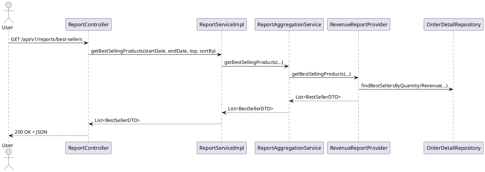

# Module Report

> Trạng thái: **Hoàn thiện** – đã refactor toàn bộ service, provider, exception và tài liệu hóa.

## 1. Tổng quan chức năng
- Cung cấp hệ thống báo cáo kinh doanh cho quản lý/điều hành.
- Hỗ trợ thống kê doanh thu, lợi nhuận, chi phí, tồn kho, khách hàng, nhân viên, phương thức thanh toán.
- Hỗ trợ xuất báo cáo Excel cho đơn hàng, tồn kho, chi phí.
- Cung cấp dữ liệu cho dashboard admin/manager/staff.

## 2. Kiến trúc module
```
ReportService (interface)
 └── ReportServiceImpl (facade)
       ├── ReportAggregationService
       │     ├── RevenueReportProvider
       │     ├── InventoryReportProvider
       │     ├── ExpenseReportProvider
       │     └── AnalyticsReportProvider
       └── ReportExcelExportService
```
- **ReportServiceImpl** giữ vai trò facade, đảm bảo không đổi API của controller.
- **ReportAggregationService** tập hợp kết quả từ các provider chuyên trách.
- **Provider** chỉ chứa nghiệp vụ đọc (tối ưu truy vấn, tính toán số liệu) và không ném checked exception.
- **ReportExcelExportService** gom toàn bộ logic Apache POI, tái sử dụng `ExcelSheetBuilder` cho header/style.
- **Helper** (`ReportDateValidator`, `ReportCalculationHelper`, `ReportTimeSeriesHelper`) dùng chung cho validation, phép chia an toàn, xử lý chuỗi thời gian.
- **Exception** chuẩn hóa: `ReportValidationException` (400) cho dữ liệu đầu vào, `ReportExportException` (500) cho lỗi xuất file.

## 3. Luồng xử lý tiêu biểu


## 4. Endpoints liên quan (không đổi contract)
| HTTP | Đường dẫn | Mô tả |
|------|-----------|------|
| GET | `/api/v1/reports/daily-revenue?date=yyyy-MM-dd` | Doanh thu theo ngày |
| GET | `/api/v1/reports/inventory?lowStock=false` | Danh sách nguyên liệu (lọc thiếu nếu `lowStock=true`) |
| GET | `/api/v1/reports/orders/export?startDate&endDate` | Xuất Excel đơn hàng |
| GET | `/api/v1/reports/profit?startDate&endDate` | Báo cáo lợi nhuận |
| GET | `/api/v1/reports/best-sellers?startDate&endDate&top&sortBy` | Sản phẩm bán chạy |
| GET | `/api/v1/reports/product-sales-summary?startDate&endDate` | Tổng quan doanh số theo sản phẩm |
| GET | `/api/v1/reports/revenue-by-date?startDate&endDate` | Doanh thu theo từng ngày |
| GET | `/api/v1/reports/expenses-by-date?startDate&endDate` | Chi phí theo ngày / danh mục |
| GET | `/api/v1/reports/top-customers?startDate&endDate&top` | Top khách hàng |
| GET | `/api/v1/reports/staff-performance?startDate&endDate&top` | Hiệu suất nhân viên |
| GET | `/api/v1/reports/category-sales?startDate&endDate` | Doanh số theo danh mục |
| GET | `/api/v1/reports/hourly-sales?date` | Doanh thu theo giờ |
| GET | `/api/v1/reports/payment-method-stats?startDate&endDate` | Thống kê phương thức thanh toán |
| GET | `/api/v1/reports/sales-comparison?...` | So sánh hai giai đoạn |
| GET | `/api/v1/reports/dashboard` | Thống kê tổng hợp dashboard |
| GET | `/api/v1/reports/inventory/export` | Xuất Excel tồn kho |
| GET | `/api/v1/reports/expenses/export?startDate&endDate` | Xuất Excel chi phí |
| GET | `/api/v1/reports/total-expenses?startDate&endDate` | Tổng chi phí |
| GET | `/api/v1/reports/total-imported-ingredients?startDate&endDate` | Tổng chi phí nhập nguyên liệu |

## 5. DTO chính
- `BestSellerDTO`, `ProductSalesSummaryDTO/ResponseDTO`, `CategorySalesDTO`, `CustomerAnalyticsDTO`, `StaffPerformanceDTO`, `HourlySalesDTO`, `PaymentMethodStatsDTO`, `SalesComparisonDTO`, `DashboardStatsDTO`.
- Tất cả giữ nguyên schema trước refactor, phục vụ cho frontend khi build dashboard.

## 6. Exception & Validation
- `ReportValidationException`: dùng khi `startDate > endDate` hoặc thiếu tham số bắt buộc.
- `ReportExportException`: quấn lỗi IO khi tạo workbook, được `GlobalExceptionHandler` xử lý thành HTTP 500 với thông điệp rõ ràng.
- `ReportDateValidator` cung cấp 2 phương thức `validateMandatoryRange` và `validateOptionalRange`.

## 7. Tối ưu hóa/Best Practice
- Truy vấn repo chỉ chạy một lần mỗi nghiệp vụ (dùng `sumAmountBetweenDates`, `findTopCustomersBetweenDates`...).
- Sử dụng `Specification.allOf` thay vì API deprecated.
- Tái sử dụng `ReportCalculationHelper.safeDivide` để tránh `ArithmeticException`.
- Ghi log ở mức `info` khi export thành công/thất bại.
- Các provider `@Transactional(readOnly = true)` để đảm bảo hiệu năng.

## 8. Xuất Excel
```json
{
  "orders-export": {
    "sheet": "Orders",
    "columns": [
      "Order ID", "Table", "Staff", "Type", "Status",
      "Created At", "Paid At", "Payment Method", "SubTotal",
      "Discount", "Total Amount", "Items"
    ],
    "dateFormat": "yyyy-MM-dd HH:mm:ss"
  }
}
```
- Tất cả workbook sử dụng `XSSFWorkbook`, autosize column sau khi ghi.
- Danh sách item đơn hàng được ghép dạng `Tên sản phẩm (xSố lượng)`.

## 9. Testing
- `./mvnw clean test` đã chạy thành công sau refactor.
- Unit test hiện tại (ví dụ `ReportController`/dashboard) không cần cập nhật vì API giữ nguyên.
- Khi bổ sung test mới, mock `ReportService` (interface) – không mock provider trực tiếp.

## 10. Checklist tạo PR
- [x] Code biên dịch, test pass (`./mvnw clean test`).
- [x] Document module (file này) cập nhật đầy đủ cho backend/frontend.
- [x] Không thay đổi contract REST; kiểm tra swagger/openAPI nếu có.
- [x] Không còn cảnh báo deprecated quan trọng (đã xử lý `Specification.where`, `BigDecimal.ROUND_HALF_UP`).
- [ ] Khi chuẩn bị PR, đính kèm mô tả ngắn gọn refactor + link tài liệu này.

## 11. Lưu ý khi mở rộng
- Nếu bổ sung báo cáo mới, tạo provider chuyên trách → thêm vào `ReportAggregationService` để giữ cấu trúc sạch.
- Khi export Excel mới, mở rộng `ReportExcelExportService` hoặc tách thành lớp mới nhưng tái sử dụng `ExcelSheetBuilder`.
- Đảm bảo mọi ngày tháng đi qua `ReportDateValidator` trước khi truy vấn.

---
**Hoàn thành: 100%**
