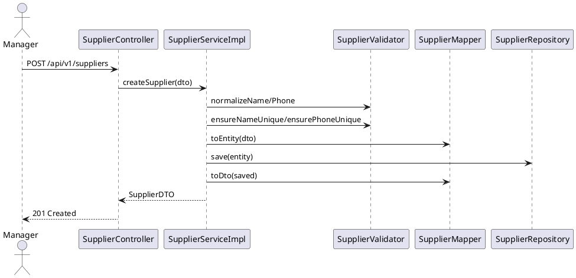

# Module Nhà cung cấp (Supplier)

> Trạng thái: **Hoàn thiện** – service tách interface/impl, validator riêng, exception chuẩn hóa, unit test đầy đủ.

## 1. Mục tiêu & Phạm vi
- Quản lý thông tin nhà cung cấp: tạo, xem, cập nhật, xoá.
- Đảm bảo tên và số điện thoại duy nhất, dữ liệu hợp lệ, không thay đổi contract API hiện có.
- Cung cấp dữ liệu cho các luồng nhập hàng (Purchase Order) thông qua REST API.

## 2. Kiến trúc tổng quan
```
controller.SupplierController
        │
        ▼
service.SupplierService (interface)
        │
        ▼
service.impl.SupplierServiceImpl
        ├── SupplierRepository
        ├── SupplierMapper (MapStruct)
        └── SupplierValidator (helper)
```
- `SupplierServiceImpl` chịu trách nhiệm orchestrate nghiệp vụ, logging, transaction.
- `SupplierValidator` gom logic chuẩn hóa tên/SĐT, kiểm tra tồn tại và ném exception domain.
- `SupplierMapper` map entity ↔ DTO, tái sử dụng cho cả get list và CRUD.
- Exception chuyên biệt kế thừa `BusinessException` đảm bảo response chuẩn.

## 3. Luồng chính


## 4. API (không đổi contract)
| HTTP | Đường dẫn | Mô tả | Vai trò |
|------|-----------|-------|---------|
| GET | `/api/v1/suppliers` | Danh sách nhà cung cấp | MANAGER, ADMIN |
| GET | `/api/v1/suppliers/{id}` | Chi tiết theo ID | MANAGER, ADMIN |
| POST | `/api/v1/suppliers` | Tạo mới từ `SupplierDTO` | MANAGER, ADMIN |
| PUT | `/api/v1/suppliers/{id}` | Cập nhật thông tin | MANAGER, ADMIN |
| DELETE | `/api/v1/suppliers/{id}` | Xoá nhà cung cấp | ADMIN |

## 5. DTO & Entity
- `SupplierDTO`
  - `id`
  - `name` (`@NotBlank`)
  - `contactPerson`
  - `phone` (`@NotBlank`)
  - `email` (`@Email`)
  - `address`
- `Supplier` entity
  - Ràng buộc `name` unique, `phone` not null.
  - Các trường `contactPerson`, `email`, `address` lưu bổ sung.

Ví dụ response:
```json
{
  "id": 7,
  "name": "ACME",
  "contactPerson": "John Doe",
  "phone": "0909123456",
  "email": "john@example.com",
  "address": "123 Street"
}
```

## 6. Validator & Quy tắc
- `normalizeName`: chuẩn hoá khoảng trắng, reject rỗng.
- `normalizePhone`: loại bỏ khoảng trắng, reject rỗng.
- `ensureNameUnique/ensurePhoneUnique`: tra repository, log nhẹ khi không đổi, ném `SupplierConflictException` khi trùng.
- `requireExistingSupplier`: load entity, ném `SupplierNotFoundException` (HTTP 404).

## 7. Exception mapping
| Exception | HTTP | Ngữ cảnh |
|-----------|------|----------|
| `SupplierNotFoundException` | 404 | Không tìm thấy nhà cung cấp |
| `SupplierConflictException` | 409 | Tên hoặc SĐT trùng |
| `SupplierValidationException` | 400 | Dữ liệu đầu vào không hợp lệ |

## 8. Kiểm thử
- `SupplierServiceTest` (Mockito) @com.giapho.coffee_shop_backend.service.SupplierServiceTest: cover toàn bộ CRUD, đảm bảo validator được gọi đúng và repository hoạt động như mong đợi.
- Mệnh lệnh: `./mvnw -q -Dtest=SupplierServiceTest test` hoặc `./mvnw clean test` để verify.

## 9. Checklist hoàn tất
- [x] Service tách interface/impl, helper validator riêng.
- [x] Exception domain chuẩn hóa.
- [x] Validator xử lý normalize + uniqueness.
- [x] Controller giữ nguyên contract, chỉ cập nhật import.
- [x] Unit test mới bao phủ CRUD service.
- [x] Tài liệu tiếng Việt (file này).

---
**Hoàn thành: 100%**
