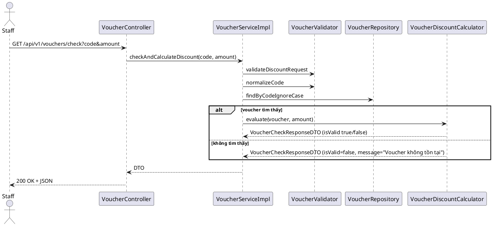

# Module Voucher

> Trạng thái: **Hoàn thiện** – đã refactor theo chuẩn clean code, tách interface/impl, bổ sung tài liệu.

## 1. Mục tiêu & Chức năng chính
- Quản lý voucher khuyến mãi: tạo, cập nhật, bật/tắt, xóa, thống kê.
- Kiểm tra tính hợp lệ voucher và tính toán số tiền giảm cho đơn hàng.
- Cung cấp API tìm kiếm theo mã, trạng thái, khoảng thời gian hiệu lực.
- Tổng hợp số liệu (voucher đang hoạt động, sắp hết hạn, đã sử dụng).

## 2. Kiến trúc tổng thể
```
VoucherService (interface)
 └── VoucherServiceImpl
       ├── VoucherValidator
       ├── VoucherMapper
       ├── VoucherDiscountCalculator
       └── VoucherSearchSpecificationBuilder
```
- `VoucherServiceImpl` đóng vai trò facade, điều phối nghiệp vụ và logging.
- Các helper giữ trách nhiệm riêng: validate (VoucherValidator), mapping DTO (VoucherMapper), tính giảm giá (VoucherDiscountCalculator), build `Specification` tìm kiếm.
- Exception được chuẩn hóa (`VoucherNotFoundException`, `VoucherValidationException`, `VoucherConflictException`, `VoucherInvalidException`).
- Entity `Voucher` tự cập nhật `createdAt`/`updatedAt` qua `@PrePersist/@PreUpdate`.

## 3. Luồng xử lý điển hình
### 3.1 Kiểm tra voucher khi thanh toán


### 3.2 CRUD Voucher
1. **Create/Update**: Controller nhận `VoucherRequestDTO` → `VoucherServiceImpl` → `VoucherValidator` (chuẩn hóa mã, kiểm tra business rule) → `VoucherMapper` map sang entity → lưu repository → map trả lại `VoucherResponseDTO`.
2. **Toggle/Delete**: Facade tải voucher (`VoucherNotFoundException` nếu không tồn tại), kiểm tra điều kiện (ví dụ không cho xóa nếu đã dùng) → cập nhật trạng thái → log → trả response.

## 4. API Endpoints (không đổi contract)
| HTTP | URL | Mô tả |
|------|-----|-------|
| GET | `/api/v1/vouchers/check?code&amount` | Kiểm tra voucher, trả `VoucherCheckResponseDTO` (isValid, message, discountAmount, type) |
| POST | `/api/v1/vouchers` | Tạo voucher mới từ `VoucherRequestDTO` |
| PUT | `/api/v1/vouchers/{id}` | Cập nhật voucher |
| PATCH | `/api/v1/vouchers/{id}/toggle` | Bật/tắt trạng thái active |
| DELETE | `/api/v1/vouchers/{id}` | Xóa voucher chưa sử dụng |
| GET | `/api/v1/vouchers` | Tìm kiếm (code, type, active, validFrom, validTo) |
| GET | `/api/v1/vouchers/{id}` | Lấy chi tiết |
| GET | `/api/v1/vouchers/summary` | Thống kê `VoucherSummaryDTO` |

## 5. DTO chính
- `VoucherRequestDTO` (tạo/cập nhật) – đã có validate annotation (`@NotBlank`, `@Future`, `@DecimalMin`...).
- `VoucherResponseDTO` (dùng cho CRUD, search).
- `VoucherCheckResponseDTO` (check voucher: isValid, message, discountAmount, type, code).
- `VoucherSummaryDTO` (thống kê, gồm activeCount, inactiveCount, expiringSoonCount, redeemedCount).

## 6. Helper chi tiết
- **VoucherValidator**: 
  - `validateBusinessRules`, `ensureCodeUnique`, `ensureCodeAvailableForUpdate`, `ensureUsageLimitNotLessThanTimesUsed`, `validateDiscountRequest`, `normalizeCode`, `hasText`.
- **VoucherMapper**: 
  - `toEntity`, `updateEntity`, `toResponse` (trim mô tả, truncate thời gian tới giây để đồng nhất).
- **VoucherDiscountCalculator**: 
  - `evaluate` (kiểm tra active, usage limit, thời gian, minimum order; trả DTO valid/invalid).
  - `buildNotFoundResponse` (khi voucher không tồn tại).
- **VoucherSearchSpecificationBuilder**: 
  - Xây dựng danh sách predicate theo code/type/active/validFrom/validTo.

## 7. Exception chuẩn hóa
- `VoucherNotFoundException` (404) – bọc cho mọi trường hợp không tìm thấy (cả ID lẫn code khi cần).
- `VoucherValidationException` (400) – dữ liệu đầu vào sai (ví dụ `validFrom > validTo`).
- `VoucherConflictException` (409) – trùng mã voucher.
- `VoucherInvalidException` (400) – trạng thái không hợp lệ (đã dùng, xóa khi đã sử dụng, v.v.).
Tất cả đều extends `BusinessException` → `GlobalExceptionHandler` convert sang response chuẩn.

## 8. Interaction với module khác
- `PaymentService` & `OrderPricingService` sử dụng `VoucherService` interface mới để kiểm tra/áp dụng voucher; logic vẫn giữ nguyên.
- `OrderPricingService.recalculateTotals` gọi `VoucherService.checkAndCalculateDiscount` khi có voucher gắn với đơn hàng.

## 9. Kiểm thử
- `VoucherServiceTest` được cập nhật để mock `VoucherValidator`, `VoucherMapper`, `VoucherDiscountCalculator`, `VoucherSearchSpecificationBuilder`.
- Đảm bảo test kiểm tra đúng exception mới (Conflict/Validation/NotFound).
- `./mvnw clean test` pass.
- Cảnh báo trong `PayrollServiceTest` (“unchecked operations”) giữ nguyên do code gốc – không ảnh hưởng.

## 10. Checklist hoàn thành
- [x] Refactor service sang interface/impl, helper riêng.
- [x] Chuẩn hóa exception, response.
- [x] Giữ nguyên API contract controller.
- [x] Cập nhật test (unit) và chạy `./mvnw clean test` thành công.
- [x] Cập nhật tài liệu (file này).
- [x] Kiểm tra import, logging (dùng `log.info` cho thao tác chính; helper không log thừa).

## 11. Gợi ý mở rộng
- Khi thêm điều kiện lọc mới cho search, chỉ cần bổ sung predicate trong `VoucherSearchSpecificationBuilder`.
- Nếu cần support bulk toggle hoặc import, xây dựng service riêng sử dụng lại validator/mapper.
- Để tích hợp caching (ví dụ voucher phổ biến), có thể caching kết quả `findByCodeIgnoreCase`.

---
**Hoàn thành: 100%**
