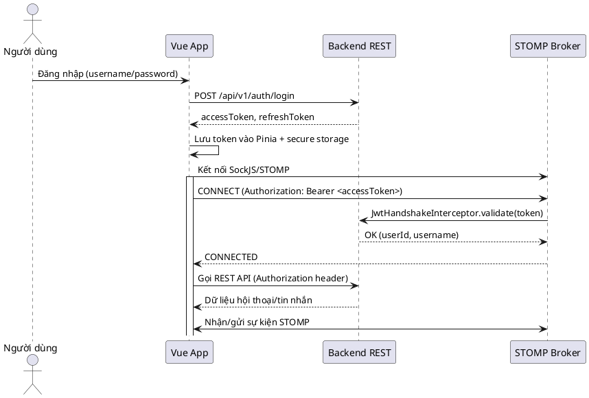

# Hướng dẫn Tích hợp Chat Service cho Frontend Vue

> **Phiên bản**: 2025-11-19 &mdash; Khớp với nhánh `main` hiện tại của backend.

---

## 1. Tổng quan

- **Stack đề xuất**: Vue 3 + Vite, TypeScript, Pinia (state), Vue Router, Axios, `@stomp/stompjs`, `sockjs-client`.
- **Endpoint nền tảng**: REST bắt đầu bằng `/api`, WebSocket STOMP tại `/ws` (đã được `permitAll` ở Spring Security nhưng vẫn yêu cầu JWT qua handshake interceptor).
- **Bảo mật**: JWT access token (`Authorization: Bearer <token>`), refresh token REST.
- **Chức năng chính cần cover**:
  1. Danh sách hội thoại và chi tiết hội thoại (REST + realtime update).
  2. Gửi tin nhắn (text, emoji, file) & xử lý trạng thái gửi.
  3. Sự kiện realtime: tin nhắn mới, đã xem, cập nhật pinned.
  4. Quản lý lỗi (token hết hạn, thiếu quyền, upload thất bại).

---

## 2. Flow xác thực & handshake WebSocket



**Lưu ý quan trọng**
- Nếu thiếu header `Authorization` (hoặc query `?token=`) khi kết nối STOMP, handshake bị từ chối & SockJS trả về 404 cho các fallback URL (`/ws/iframe.html`).
- Nếu access token hết hạn trong lúc handshake, backend trả `401`, client phải tự động refresh, cập nhật header, rồi kết nối lại.

---

## 3. Thiết lập dự án Vue

```bash
npm install axios pinia @stomp/stompjs sockjs-client dayjs
```

Cấu hình Vite ENV (`.env`):

```
VITE_API_BASE_URL=http://localhost:8088
VITE_WS_ENDPOINT=ws://localhost:8088/ws
```

Tạo module cấu hình chung (`src/config/chat.ts`):

```ts
export const chatConfig = {
  apiBaseUrl: import.meta.env.VITE_API_BASE_URL,
  wsEndpoint: import.meta.env.VITE_WS_ENDPOINT,
  reconnectDelay: 5000,
  maxReconnectAttempts: 10
} as const;
```

---

## 4. Quản lý state & token (Pinia)

```ts
// stores/auth.store.ts
import { defineStore } from 'pinia';
import axios from 'axios';

export const useAuthStore = defineStore('auth', {
  state: () => ({
    accessToken: '' as string,
    refreshToken: '' as string,
    user: null as AuthUser | null
  }),
  actions: {
    async login(payload: LoginPayload) {
      const { data } = await axios.post('/api/v1/auth/login', payload);
      this.accessToken = data.accessToken;
      this.refreshToken = data.refreshToken;
      this.user = data.user;
      axios.defaults.headers.common.Authorization = `Bearer ${data.accessToken}`;
    },
    async refresh() {
      const { data } = await axios.post('/api/v1/auth/refresh', {
        refreshToken: this.refreshToken
      });
      this.accessToken = data.accessToken;
      this.refreshToken = data.refreshToken;
      axios.defaults.headers.common.Authorization = `Bearer ${data.accessToken}`;
    }
  }
});
```

Cấu hình interceptor Axios để tự refresh khi gặp `401` (`AUTH-EXPIRED`):

```ts
axios.interceptors.response.use(undefined, async error => {
  const auth = useAuthStore();
  if (error.response?.status === 401 && error.response.data?.code === 'AUTH-EXPIRED') {
    await auth.refresh();
    error.config.headers.Authorization = `Bearer ${auth.accessToken}`;
    return axios.request(error.config);
  }
  return Promise.reject(error);
});
```

---

## 5. Tích hợp STOMP trong Vue

### 5.1. Khởi tạo client

```ts
import { Client, IMessage, StompSubscription } from '@stomp/stompjs';
import SockJS from 'sockjs-client';
import { chatConfig } from '@/config/chat';
import { useAuthStore } from '@/stores/auth.store';

class ChatSocketService {
  private client: Client | null = null;
  private subscriptions: StompSubscription[] = [];

  connect() {
    const auth = useAuthStore();
    this.client = new Client({
      webSocketFactory: () => new SockJS(`${chatConfig.apiBaseUrl}/ws`, undefined, {
        transportOptions: {
          'xhr-polling': { timeout: 20000 }
        }
      }),
      reconnectDelay: chatConfig.reconnectDelay,
      maxWebSocketChunkSize: 8 * 1024,
      connectHeaders: {
        Authorization: `Bearer ${auth.accessToken}`
      },
      debug: false
    });

    this.client.onConnect = () => {
      this.subscribeConversations();
      this.subscribeConversation(auth.user?.activeConversationId);
    };

    this.client.onStompError = frame => {
      console.error('STOMP error', frame.headers['message']);
    };

    this.client.activate();
  }

  subscribeConversations() {
    this.subscriptions.push(
      this.client!.subscribe('/topic/conversations', message => {
        const payload: ConversationSummary = JSON.parse(message.body);
        conversationStore.upsertConversation(payload);
      })
    );
  }

  subscribeConversation(conversationId?: number) {
    if (!conversationId) return;
    this.subscriptions.push(
      this.client!.subscribe(`/topic/conversations/${conversationId}`, message => {
        const payload: MessageDTO = JSON.parse(message.body);
        messageStore.upsertMessage(payload);
      })
    );
  }

  disconnect() {
    this.subscriptions.forEach(sub => sub.unsubscribe());
    this.client?.deactivate();
  }
}

export const chatSocketService = new ChatSocketService();
```

### 5.2. Xử lý reconnect & token hết hạn

- Khi `onWebSocketClose` báo lỗi `401` hoặc `403`, gọi `auth.refresh()` rồi `connect()` lại.
- Hạn chế hiển thị modal lỗi liên tục: debounce thông báo.
- Nếu refresh thất bại, điều hướng về màn đăng nhập.

### 5.3. Gửi tin nhắn qua REST + chờ realtime phản hồi

```ts
export async function sendTextMessage(conversationId: number, content: string) {
  const optimisticId = `tmp-${Date.now()}`;
  messageStore.appendOptimistic({
    id: optimisticId,
    conversationId,
    content,
    status: 'SENDING',
    createdAt: new Date().toISOString()
  });

  try {
    await axios.post(`/api/chat/conversations/${conversationId}/messages/text`,
      new URLSearchParams({ content }));
  } catch (error) {
    messageStore.markFailed(optimisticId);
    throw error;
  }
}
```

---

## 6. REST API cần sử dụng từ Vue

| Mục đích | Method & Path | Ghi chú |
| --- | --- | --- |
| Danh sách hội thoại | `GET /api/chat/conversations` | Phân trang `page`, `size`. |
| Chi tiết hội thoại | `GET /api/chat/conversations/{id}` | Dùng khi vào màn chat. |
| Load tin nhắn | `GET /api/chat/conversations/{id}/messages` | Tham số `beforeMessageId` để infinite scroll. |
| Gửi text | `POST /api/chat/conversations/{id}/messages/text` | Body `content`. |
| Gửi emoji | `POST /api/chat/conversations/{id}/messages/emoji` | Body `code`. |
| Gửi file | `POST /api/chat/conversations/{id}/messages/attachments` | Multipart `files[]`. |
| Pin/unpin | `PATCH /api/chat/conversations/{id}/pin` | Body `{ "pinned": true }`. |
| Seen | `POST /api/chat/conversations/{id}/messages/{messageId}/seen` | Reply `204`. |

Khuyến nghị tạo service wrapper Axios (`src/services/chat.service.ts`) để tái sử dụng và gom logic xử lý lỗi.

---

## 7. JSON mẫu cấu hình màn hình chat Vue

```json
{
  "conversationList": {
    "pageSize": 20,
    "filters": {
      "pinnedFirst": true,
      "searchDelayMs": 300
    }
  },
  "messageList": {
    "pageSize": 30,
    "fetchOlderTrigger": "scroll-top",
    "debounceNewMessageMs": 100
  },
  "realtime": {
    "reconnectDelayMs": 5000,
    "maxAttempts": 10,
    "toastOnDisconnect": true
  }
}
```

---

## 8. Quy tắc UI/UX cho Vue

1. **Sidebar hội thoại**: hiển thị `unreadCount`, tooltip `updatedAt` định dạng `DD/MM HH:mm` (dùng Day.js).
2. **Chat window**: tin nhắn hiển thị theo `createdAt` tăng dần; trường `status`:
   - `SENT`: hiển thị icon ✓.
   - `RECALLED`: hiển thị text "Tin nhắn đã bị thu hồi".
   - `FAILED`: hiển thị nút "Gửi lại".
3. **Input**: disable khi chưa chọn hội thoại hoặc khi đang gửi file.
4. **Upload file**: hiển thị preview `storedUrl`, size; nếu 415/400 -> toast "Định dạng không hỗ trợ".
5. **Seen indicator**: map `userId` -> avatar; cập nhật khi nhận topic `/topic/conversations/{id}/seen`.

---

## 9. Checklist kiểm thử phía FE

| Hạng mục | Kịch bản | Kết quả mong đợi |
| --- | --- | --- |
| Login | Sai password | Hiển thị lỗi từ backend. |
| STOMP handshake | Thiếu token | Không kết nối, hiển thị toast "Vui lòng đăng nhập lại". |
| Refresh token | Access token hết hạn khi đang kết nối | Tự refresh, kết nối lại sau <5s. |
| Gửi text | Nhập rỗng | Bị chặn client, highlight input. |
| Gửi file | File >5MB | Backend trả 400 `FILE-TOO-LARGE`, hiển thị toast. |
| Realtime | Người A gửi tin, người B nhận | Tin hiển thị realtime, unread giảm. |
| Seen | Người B mở chat | Người A nhận event `/seen` và cập nhật UI. |
| Mất kết nối mạng | Ngắt mạng 10s | Hiển thị banner reconnect, tự kết nối lại khi mạng ổn định. |

---

## 10. Kênh hỗ trợ & ghi chú

- **Log**: FE nên log lỗi quan trọng lên Sentry/Elastic để đối chiếu với log backend (`logs/application.log`).
- **Tham chiếu mã**: `com.giapho.coffee_shop_backend.chat.service.impl.ConversationServiceImpl`, `ChatWebSocketConfig`, `JwtHandshakeInterceptor`.
- **Phân quyền**: Path `/ws` đã `permitAll` nhưng Nin handshake vẫn xem token. Đảm bảo FE luôn truyền token khi gọi SockJS.

---

Hoàn thành: 100%
