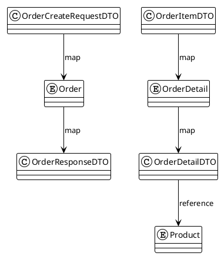

# DTO, Entity, Mapper & Validation

## Mục lục
- [1. Nguyên tắc chung](#1-nguyên-tắc-chung)
- [2. Danh sách DTO chính](#2-danh-sách-dto-chính)
- [3. Mối quan hệ Entity ↔ DTO ↔ API](#3-mối-quan-hệ-entity--dto--api)
- [4. Mapper (MapStruct)](#4-mapper-mapstruct)
- [5. Quy tắc validation](#5-quy-tắc-validation)
- [6. Ví dụ triển khai](#6-ví-dụ-triển-khai)

## 1. Nguyên tắc chung
- DTO dùng để giao tiếp bên ngoài (REST API), không lộ entity nội bộ.
- Sử dụng hậu tố: `RequestDTO`, `ResponseDTO`, `SummaryDTO`, `DetailDTO`.
- Không truyền entity trực tiếp cho Controller; Service chỉ trả DTO.
- MapStruct giảm boilerplate và hỗ trợ mapping có điều kiện.
- Validation đặt tại DTO (Jakarta Validation) và kiểm tra bổ sung tại Service.

## 2. Danh sách DTO chính
| Module | Request DTO | Response DTO | Ghi chú |
|--------|-------------|--------------|---------|
| Auth | `LoginRequest`, `RegisterRequest` | `AuthenticationResponse` | Login trả JWT, register trả token |
| User | `CreateUserRequestDTO`, `UpdateUserRequestDTO` | `UserResponseDTO`, `UserSummaryDTO` | Dùng cho quản lý nhân sự |
| Product | `ProductRequestDTO`, `ProductIngredientDTO` | `ProductResponseDTO`, `ProductSummaryDTO` | Bao gồm thông tin công thức |
| Category | `CategoryRequestDTO` | `CategoryResponseDTO` | |
| Order | `OrderCreateRequestDTO`, `OrderItemDTO`, `OrderPaymentRequestDTO` | `OrderResponseDTO`, `OrderDetailDTO` | |
| Voucher | `VoucherRequestDTO`, `VoucherConditionDTO` | `VoucherResponseDTO`, `VoucherValidationResponse` | |
| Customer | `CustomerRequestDTO` | `CustomerResponseDTO`, `CustomerOrderHistoryDTO` | |
| Inventory | `PurchaseOrderRequestDTO`, `PurchaseOrderItemDTO` | `PurchaseOrderResponseDTO` | |
| Attendance | `AttendanceCheckInRequest`, `AttendanceCheckOutRequest` | `AttendanceDTO` | |
| Payroll | `PayrollCycleRequest`, `PayrollAdjustmentDTO` | `PayrollSummaryDTO` | |
| Reporting | `DashboardFilterDTO` | `DashboardMetricsDTO`, `RevenueReportDTO` | |

## 3. Mối quan hệ Entity ↔ DTO ↔ API

- Controller nhận `OrderCreateRequestDTO`, gọi `OrderMapper.requestToEntity()`, Service xử lý entity.
- Sau khi lưu, Service trả `OrderMapper.entityToResponse()`.

## 4. Mapper (MapStruct)
- Đặt trong package `com.giapho.coffee_shop_backend.mapper`.
- Mỗi module có mapper riêng: `OrderMapper`, `ProductMapper`, `VoucherMapper`, `AttendanceMapper`, `PayrollMapper`.
- Cấu hình chung trong `@Mapper(componentModel = "spring", uses = {...})`.

**Ví dụ `OrderMapper`**
```java
@Mapper(componentModel = "spring", uses = {ProductMapper.class})
public interface OrderMapper {
    @Mapping(target = "id", ignore = true)
    @Mapping(target = "status", constant = "PENDING")
    @Mapping(target = "orderDetails", source = "items")
    Order requestToEntity(OrderCreateRequestDTO dto);

    OrderResponseDTO entityToResponse(Order order);

    @Mapping(target = "productId", source = "product.id")
    OrderDetailDTO detailToDTO(OrderDetail detail);
}
```

## 5. Quy tắc validation
- Sử dụng annotation Jakarta Validation tại DTO:
  - `@NotBlank`, `@Email`, `@Size` cho string.
  - `@Positive`, `@Min`, `@DecimalMin` cho số.
  - `@Future`, `@PastOrPresent` cho ngày.
- Validation tùy chỉnh:
  - `@ValidVoucherDateRange` cho `VoucherRequestDTO`.
  - `@ValidShiftTime` cho đăng ký ca.
  - `@MatchingPassword` cho reset password.
- Controller thêm `@Valid` vào các phương thức, `MethodArgumentNotValidException` được xử lý tập trung.

## 6. Ví dụ triển khai
```java
@Data
public class VoucherRequestDTO {
    @NotBlank
    private String code;

    @NotNull
    private VoucherType type;

    @DecimalMin(value = "0.0", inclusive = false)
    private BigDecimal discountValue;

    @DecimalMin(value = "0.0")
    private BigDecimal maxDiscount;

    @DecimalMin(value = "0.0")
    private BigDecimal minOrderTotal;

    @Min(1)
    private Integer usageLimit;

    @FutureOrPresent
    private LocalDate validFrom;

    @Future
    private LocalDate validTo;

    @AssertTrue(message = "validTo must be after validFrom")
    public boolean isDateRangeValid() {
        return validFrom == null || validTo == null || !validTo.isBefore(validFrom);
    }
}
```

---
**Mức độ hoàn thiện:** 100%
**Hạng mục còn thiếu:** Không
