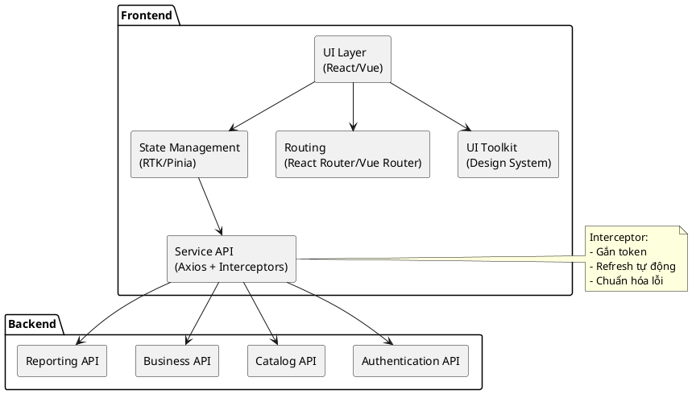
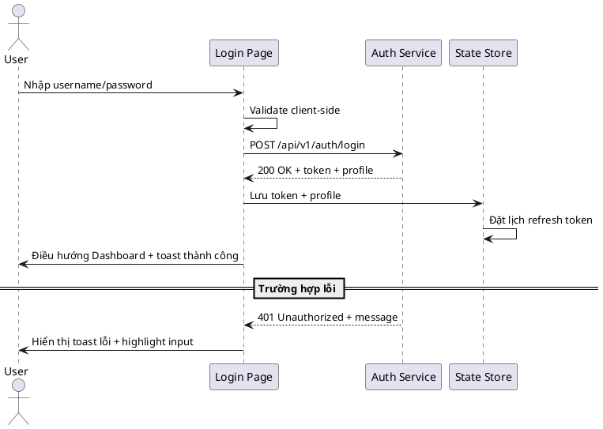

# DOCUMENT TỔNG QUAN CHỨC NĂNG FRONTEND

## Mục lục
- [1. Mục tiêu hệ thống](#1-mục-tiêu-hệ-thống)
- [2. Phạm vi sử dụng tài liệu](#2-phạm-vi-sử-dụng-tài-liệu)
- [3. Kiến trúc tổng quan](#3-kiến-trúc-tổng-quan)
  - [3.1 Sơ đồ thành phần](#31-sơ-đồ-thành-phần)
  - [3.2 Cấu trúc state & dữ liệu chia sẻ](#32-cấu-trúc-state--dữ-liệu-chia-sẻ)
- [4. Danh mục chức năng cốt lõi](#4-danh-mục-chức-năng-cốt-lõi)
  - [4.1 Bảng tổng hợp chức năng](#41-bảng-tổng-hợp-chức-năng)
  - [4.2 Luồng xác thực chuẩn](#42-luồng-xác-thực-chuẩn)
  - [4.3 Mô tả chi tiết từng module](#43-mô-tả-chi-tiết-từng-module)
- [5. Thiết kế UI/UX](#5-thiết-kế-uiux)
- [6. Chuẩn mã nguồn frontend](#6-chuẩn-mã-nguồn-frontend)
- [7. Tích hợp API & bảo mật phiên](#7-tích-hợp-api--bảo-mật-phiên)
- [8. Kịch bản kiểm thử frontend](#8-kịch-bản-kiểm-thử-frontend)
- [9. Checklist triển khai & vận hành](#9-checklist-triển-khai--vận-hành)
- [10. Tài nguyên tham chiếu](#10-tài-nguyên-tham-chiếu)

## 1. Mục tiêu hệ thống
Hệ thống frontend cung cấp trải nghiệm liền mạch cho người dùng khi thao tác với toàn bộ chức năng backend quán cà phê. Mục tiêu:
- Tối giản thao tác, rõ ràng, đồng nhất trên mọi màn hình.
- Đảm bảo khả năng mở rộng để phủ thêm module mới mà không phá vỡ kiến trúc.
- Hỗ trợ tự động hóa: dễ dàng bàn giao cho AI, đội frontend, QA hoặc UI/UX.

## 2. Phạm vi sử dụng tài liệu
Tài liệu này dùng làm khung triển khai cho:
1. Viết tài liệu dự án chi tiết cho frontend.
2. Sinh mã frontend tự động bằng AI.
3. Giao việc cho đội phát triển UI/UX & frontend.
4. Chuẩn hóa hành vi giữa backend và frontend.
5. Xây dựng test case UI/UX và test tự động phía client.

## 3. Kiến trúc tổng quan
### 3.1 Sơ đồ thành phần


### 3.2 Cấu trúc state & dữ liệu chia sẻ
```json
{
  "auth": {
    "accessToken": "string",
    "refreshToken": "string",
    "profile": {
      "id": "number",
      "username": "string",
      "roles": ["ROLE_ADMIN", "ROLE_MANAGER", "ROLE_STAFF"]
    }
  },
  "ui": {
    "theme": "light|dark",
    "loading": false,
    "toastQueue": [
      { "type": "success|error|info", "message": "string" }
    ]
  },
  "entities": {
    "users": {
      "byId": {
        "1": { "id": 1, "fullName": "string", "email": "string", "roles": [] }
      },
      "listMeta": { "page": 1, "size": 20, "total": 120 }
    },
    "catalogs": { "categories": [], "products": [] },
    "business": {
      "orders": [],
      "customers": [],
      "attendance": []
    }
  },
  "filters": {
    "globalSearch": "",
    "catalog": { "category": null, "status": "ACTIVE|INACTIVE" },
    "business": { "dateRange": ["2025-01-01", "2025-01-31"], "staffId": null }
  }
}
```

## 4. Danh mục chức năng cốt lõi
### 4.1 Bảng tổng hợp chức năng
| Mã | Chức năng | Input chính | Output chính | API backend |
|----|-----------|-------------|--------------|-------------|
| F01 | Đăng nhập | username, password | accessToken, thông tin người dùng, phân quyền | `POST /api/v1/auth/login` |
| F02 | Đăng ký | fullName, email, password, roleIds | Tài khoản mới, trạng thái | `POST /api/v1/auth/register` |
| F03 | Dashboard | Token hợp lệ | Biểu đồ, số liệu tổng hợp | `GET /api/v1/dashboard/*` |
| F04 | Quản lý danh mục | Thông tin danh mục, bộ lọc | Danh sách realtime | `GET/POST/PUT/DELETE /api/v1/categories` |
| F05 | Quản lý nghiệp vụ | Form nghiệp vụ (sản phẩm, đơn hàng, khách hàng, nhân sự, ca làm) | Cập nhật dữ liệu & UI | `GET/POST/PUT/DELETE /api/v1/{module}` |
| F06 | Modal chi tiết | ID bản ghi | Thông tin đầy đủ | `GET /api/v1/{module}/{id}` |
| F07 | Form xử lý | Giá trị form, validate rules | Submit API, thông báo lỗi/thành công | Tùy module |
| F08 | Tìm kiếm/Lọc/Sắp xếp | keyword, filters, sort | Danh sách đã xử lý | `GET /api/v1/{module}?query` |
| F09 | Thông báo/Toast | message, type | Phản hồi UI | N/A (client) |
| F10 | Quản lý phiên | refreshToken | Token mới, tự động logout | `POST /api/v1/auth/refresh` |
| F11 | Logout | - | Xóa token, reset store | N/A (client + điều hướng) |

### 4.2 Luồng xác thực chuẩn


### 4.3 Mô tả chi tiết từng module
1. **Đăng nhập (F01)**
   - Form tối đa 2 trường, hỗ trợ "Ghi nhớ đăng nhập".
   - Sau khi login lưu token vào `localStorage` + state, gắn vào interceptor Axios.
2. **Đăng ký (F02)**
   - Form nhiều bước (thông tin cơ bản, vai trò, xác nhận).
   - Xử lý lỗi trùng email/username theo mã lỗi backend.
3. **Dashboard (F03)**
   - Widget tổng quan (doanh thu, đơn hàng, nhân viên hoạt động).
   - Hỗ trợ filter nhanh theo ngày/tuần/tháng.
4. **Quản lý danh mục (F04)**
   - Bảng dữ liệu có phân trang, lọc trạng thái, tìm kiếm theo từ khóa.
   - Dialog thêm/sửa tái sử dụng component form.
5. **Quản lý dữ liệu nghiệp vụ (F05)**
   - Module con: sản phẩm, khách hàng, đơn hàng, nhân sự, chấm công.
   - Sử dụng pattern master-detail; modal chi tiết (F06) mở tại chỗ.
6. **Modal chi tiết (F06)**
   - Load dữ liệu lazy khi mở modal; cache theo ID để tái sử dụng.
7. **Form xử lý (F07)**
   - Áp dụng validation realtime, hiển thị inline.
   - Submit hiển thị trạng thái loading và khóa nút lưu.
8. **Tìm kiếm – Lọc – Sắp xếp (F08)**
   - Bộ lọc lưu vào URL query để share link.
   - Sắp xếp đa cấp (vd: trạng thái -> ngày tạo).
9. **Thông báo – Toast (F09)**
   - Queue tối đa 3 toast, auto close sau 4s, cho phép undo hành động.
10. **Quản lý phiên đăng nhập (F10)**
    - Refresh token định kỳ (trước 10% thời gian hết hạn).
    - Nếu refresh fail → logout toàn cục.
11. **Logout (F11)**
    - Xóa token, clear store, điều hướng `/login`, gửi broadcast "session-ended" cho tab khác.

## 5. Thiết kế UI/UX
- **Phản hồi người dùng**: mọi nút có hiệu ứng hover/active, hiển thị loader trong khi chờ API.
- **Loading**: sử dụng skeleton cho danh sách, spinner inline cho nút.
- **Khoảng cách**: padding tối thiểu 16px, grid 4-8-16.
- **Màu sắc**: palette chuẩn từ design system (primary, secondary, success, danger).
- **Modal**: max-width 720px, overlay 60% opacity, vẫn nhìn thấy bối cảnh.
- **Bảng**: header sticky, zebra stripe nhẹ, icon trạng thái rõ ràng.
- **Form**: nhóm trường theo logic, label trái, mô tả validation phía dưới.
- **Accessibility**: hỗ trợ keyboard navigation, aria-label cho component tương tác.

## 6. Chuẩn mã nguồn frontend
- Component nhỏ, rõ trách nhiệm; đặt trong thư mục `features/<module>/components`.
- Tách logic gọi API vào `services/<module>Service.ts` với Axios instance có interceptor.
- Sử dụng store (Redux Toolkit/Pinia) để quản lý state toàn cục, tránh prop drilling.
- Tái sử dụng hook tuỳ chỉnh (`useFetchList`, `useFormSubmit`).
- Import sạch: eslint + prettier đảm bảo thứ tự, loại bỏ unused.
- Tối ưu render: dùng memoization, virtualization cho bảng lớn.
- Phân tầng route: `App -> ProtectedLayout -> ModulePage`.
- Viết unit test (Vitest/Jest) cho component quan trọng, coverage ≥ 80% module core.

## 7. Tích hợp API & bảo mật phiên
- **Axios Interceptor**: gắn `Authorization: Bearer <token>` và bắt lỗi 401/403.
- **Quản lý refresh token**: tạo hàng đợi tránh gọi trùng; nếu refresh thành công cập nhật mọi request chờ.
- **Xử lý lỗi chuẩn**: map mã lỗi backend (vd: `ERR_DUPLICATE_EMAIL`) sang thông điệp người dùng.
- **Cấu hình môi trường**: sử dụng `.env` (`VITE_API_BASE_URL`, `VITE_SENTRY_DSN`).
- **Bảo vệ route**: guard kiểm tra quyền; chuyển hướng đến trang 403 nếu thiếu quyền.
- **Audit/UI logging**: gửi event tương tác quan trọng về backend (nếu cần) để đồng bộ audit.

## 8. Kịch bản kiểm thử frontend
| ID | Kịch bản | Mục tiêu | Bước chính | Kết quả kỳ vọng |
|----|----------|----------|------------|----------------|
| TC-FE-01 | Đăng nhập thành công | Xác thực | Nhập user hợp lệ → submit | Điều hướng Dashboard, toast thành công |
| TC-FE-02 | Đăng nhập sai mật khẩu | Xử lý lỗi | Nhập sai password → submit | Hiển thị toast lỗi, giữ input username |
| TC-FE-05 | Thêm danh mục | CRUD danh mục | Mở modal → nhập form hợp lệ → lưu | Danh sách cập nhật tức thì, modal đóng |
| TC-FE-08 | Lọc đơn hàng theo ngày | Bộ lọc | Chọn khoảng ngày → áp dụng | Danh sách hiển thị đúng kết quả |
| TC-FE-11 | Refresh token khi hết hạn | Quản lý phiên | Chờ token cũ hết hạn → gọi API | Token mới sinh, người dùng không bị đăng xuất |
| TC-FE-15 | Logout đa tab | Đồng bộ phiên | Logout tab 1 | Tất cả tab chuyển về trang login |

## 9. Checklist triển khai & vận hành
1. Cấu hình `.env` và xác nhận endpoint backend hoạt động.
2. Kiểm tra quyền CORS cho domain frontend.
3. Build production (`npm run build`) và kiểm tra bundle size < 500KB (gzip) cho entrypoint.
4. Thiết lập monitoring (Sentry/LogRocket) và dashboard hiệu năng (Lighthouse ≥ 90).
5. Chạy toàn bộ test (`npm run test`, `npm run lint`, `npm run e2e`).
6. Kiểm tra role matrix so với backend (`ROLE_ADMIN/MANAGER/STAFF`).
7. Cập nhật tài liệu UI kit khi thay đổi component lõi.

## 10. Tài nguyên tham chiếu
- API backend: xem `README.md` dự án backend để tra endpoint mới nhất.
- Design System: Figma `Coffee Shop UI Kit v2`.
- Bộ icon: `@mdi/js` (Material Design Icons).
- Tự động hóa: đề xuất dùng `Playwright` cho E2E và `Storybook` cho component.

---
**Mức độ hoàn thiện:** 100%
**Hạng mục còn thiếu:** Không
