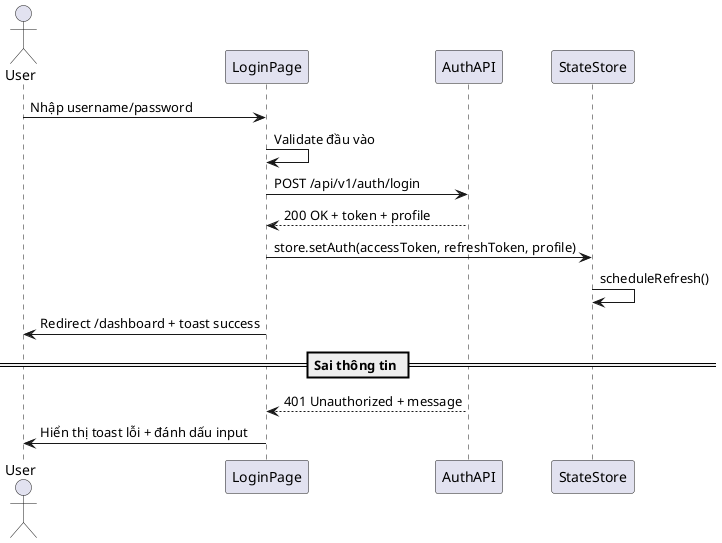

# F01 - Đăng Nhập

## Mục tiêu
- Cho phép người dùng truy cập hệ thống bằng thông tin xác thực hợp lệ.
- Thiết lập session client, lưu token và chuyển hướng đến dashboard.

## Bối cảnh sử dụng
- Người dùng đã có tài khoản được tạo trong hệ thống backend.
- Truy cập trang `/login` từ trình duyệt hoặc được điều hướng do hết phiên.

## Luồng chức năng
1. Người dùng nhập `username` và `password`.
2. Hệ thống kiểm tra validate client-side (độ dài, định dạng).
3. Gửi request `POST /api/v1/auth/login` tới backend.
4. Backend trả về `accessToken`, `refreshToken`, `profile` (id, roles, fullname).
5. Frontend lưu token vào `localStorage`, cập nhật state store.
6. Đặt lịch refresh token và điều hướng đến dashboard.
7. Hiển thị toast thành công.

## Sơ đồ tuần tự


## API liên quan
| Method | Endpoint | Mô tả |
|--------|----------|-------|
| POST | `/api/v1/auth/login` | Đăng nhập và nhận token |
| POST | `/api/v1/auth/refresh` | Làm mới token khi gần hết hạn |

## Thiết kế UI
- Form gồm 2 trường: `username`, `password`.
- Checkbox "Ghi nhớ đăng nhập" lưu token vào `localStorage`.
- Link dẫn đến trang đăng ký nếu người dùng chưa có tài khoản.
- Loading state trên nút đăng nhập, disable khi đang submit.

## State & dữ liệu
```json
{
  "auth": {
    "accessToken": "string",
    "refreshToken": "string",
    "profile": {
      "id": 12,
      "username": "staff01",
      "roles": ["ROLE_STAFF"],
      "fullName": "Nguyễn Văn A"
    }
  }
}
```

## Checklist triển khai
- [ ] Validate client-side đầy đủ (required, độ dài, feedback).
- [ ] Dùng Axios interceptor gắn header `Authorization` cho request tiếp theo.
- [ ] Lưu token an toàn, tránh XSS (sử dụng HTTPOnly cookie nếu cần).
- [ ] Điều hướng đúng theo role (vd: admin → `/dashboard/admin`).
- [ ] Hiển thị thông báo lỗi rõ ràng khi backend trả về lỗi.

## Test case đề xuất
| ID | Kịch bản | Bước | Kết quả |
|----|----------|------|---------|
| TC-F01-01 | Đăng nhập thành công | Nhập user hợp lệ → submit | Điều hướng dashboard, lưu token |
| TC-F01-02 | Sai mật khẩu | Nhập sai password → submit | Toast lỗi, giữ lại username |
| TC-F01-03 | Thiếu trường | Để trống password → submit | Hiển thị lỗi validate client |
| TC-F01-04 | Backend lỗi | Server trả 500 | Toast cảnh báo, cho phép thử lại |

---
**Mức độ hoàn thiện:** 100%
**Hạng mục còn thiếu:** Không
