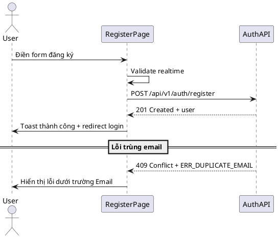

# F02 - Đăng Ký

## Mục tiêu
- Cho phép tạo tài khoản người dùng mới từ frontend.
- Thu thập đầy đủ thông tin cần thiết để backend gán vai trò phù hợp.

## Bối cảnh sử dụng
- Người dùng chưa có tài khoản nhưng được phép tự đăng ký (hoặc do quản trị gửi link).
- Trang `/register` có thể truy cập công khai hoặc chỉ dành cho quản trị viên (tuỳ cấu hình).

## Luồng chức năng
1. Người dùng truy cập trang đăng ký.
2. Chọn vai trò (nếu được cấp quyền) hoặc giữ mặc định `ROLE_STAFF`.
3. Nhập thông tin cá nhân: họ tên, email, số điện thoại, mật khẩu, xác nhận mật khẩu.
4. Validate realtime: trùng email/username, độ dài mật khẩu, định dạng.
5. Gửi request `POST /api/v1/auth/register`.
6. Backend tạo tài khoản và trả về thông tin người dùng mới hoặc lỗi.
7. Frontend hiển thị toast thành công, điều hướng sang trang đăng nhập hoặc dashboard.

## Sơ đồ trình tự


## API liên quan
| Method | Endpoint | Mô tả |
|--------|----------|-------|
| POST | `/api/v1/auth/register` | Tạo tài khoản mới |

## Thiết kế UI
- Form nhiều bước (wizard) hoặc một trang với nhóm field:
  - Bước 1: Thông tin tài khoản (username, password, confirm password).
  - Bước 2: Thông tin cá nhân (fullName, email, phone).
  - Bước 3: Vai trò (dropdown, chỉ hiển thị nếu user hiện tại có quyền).
- Thanh tiến trình (progress) rõ ràng, cho phép quay lại bước trước.
- Checkbox đồng ý điều khoản sử dụng.

## State & dữ liệu
```json
{
  "registerForm": {
    "username": "string",
    "email": "string",
    "phone": "string",
    "password": "string",
    "confirmPassword": "string",
    "roleIds": [2]
  },
  "ui": {
    "isSubmitting": false,
    "errors": {
      "email": null,
      "password": null
    }
  }
}
```

## Checklist triển khai
- [ ] Validate định dạng email, số điện thoại, mật khẩu ≥ 8 ký tự.
- [ ] Đảm bảo mật khẩu được mask và có toggle hiển thị.
- [ ] Map lỗi backend (`ERR_DUPLICATE_EMAIL`, `ERR_WEAK_PASSWORD`).
- [ ] Hiển thị tooltip mô tả quyền tương ứng với role.
- [ ] Gọi login tự động sau khi đăng ký (tuỳ yêu cầu) hoặc điều hướng trang login.

## Test case đề xuất
| ID | Kịch bản | Bước | Kết quả |
|----|----------|------|---------|
| TC-F02-01 | Đăng ký thành công | Nhập dữ liệu hợp lệ → submit | Toast thành công, điều hướng login |
| TC-F02-02 | Trùng email | Dùng email đã tồn tại → submit | Hiển thị lỗi "Email đã tồn tại" |
| TC-F02-03 | Mật khẩu yếu | Nhập mật khẩu <8 ký tự | Báo lỗi realtime |
| TC-F02-04 | Vai trò không hợp lệ | Chọn role ngoài quyền | Backend trả 403, hiển thị toast cảnh báo |

---
**Mức độ hoàn thiện:** 100%
**Hạng mục còn thiếu:** Không
