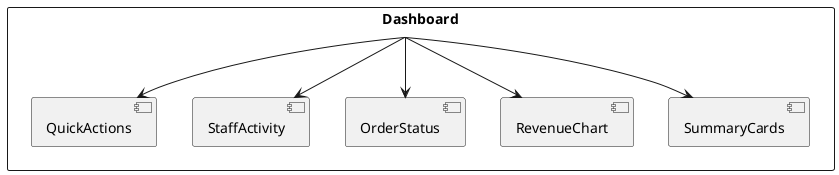

# F03 - Dashboard

## Mục tiêu
- Cung cấp cái nhìn tổng quan về tình trạng vận hành quán cà phê.
- Hỗ trợ điều hướng nhanh đến các module quan trọng.

## Bối cảnh sử dụng
- Người dùng đã đăng nhập thành công và có quyền truy cập dashboard.
- Dashboard là màn hình đầu tiên sau khi xác thực thành công.

## Luồng chức năng
1. Sau khi đăng nhập, frontend gọi các API tổng hợp dữ liệu (doanh thu, đơn hàng, nhân viên, kho).
2. Hiển thị widget chính: doanh thu ngày, số đơn hàng đang xử lý, số bàn trống.
3. Cung cấp shortcut điều hướng đến module chi tiết (đơn hàng, sản phẩm, nhân sự).
4. Cho phép lọc khoảng thời gian (ngày, tuần, tháng) và cập nhật biểu đồ realtime.
5. Hiển thị thông báo hệ thống quan trọng (maintenance, sự cố).

## Sơ đồ component


## API liên quan
| Method | Endpoint | Mô tả |
|--------|----------|-------|
| GET | `/api/v1/dashboard/revenue?from=&to=` | Doanh thu theo khoảng thời gian |
| GET | `/api/v1/dashboard/orders/summary` | Thống kê trạng thái đơn |
| GET | `/api/v1/dashboard/staff/activity` | Hiệu suất nhân viên |
| GET | `/api/v1/dashboard/inventory/alerts` | Cảnh báo tồn kho |

## Thiết kế UI
- Layout 2 cột (≥1200px) hoặc stacked (mobile).
- Biểu đồ sử dụng thư viện Chart.js hoặc ECharts, hỗ trợ hover tooltip.
- Summary card có icon, màu sắc phản ánh trạng thái (green = tốt, orange = cần chú ý).
- Danh sách thông báo hiển thị tối đa 5 mục, link đến trang chi tiết.

## State & dữ liệu
```json
{
  "dashboard": {
    "filters": {
      "range": "week",
      "from": "2025-01-01",
      "to": "2025-01-07"
    },
    "widgets": {
      "revenue": {
        "amount": 125000000,
        "growth": 12.5
      },
      "orders": {
        "processing": 8,
        "completed": 120,
        "canceled": 3
      },
      "staff": {
        "active": 15,
        "absent": 2
      }
    },
    "chartData": [
      { "date": "2025-01-01", "revenue": 15000000 },
      { "date": "2025-01-02", "revenue": 18000000 }
    ],
    "alerts": [
      { "type": "inventory", "message": "Hạt Arabica dưới 20%" }
    ]
  }
}
```

## Checklist triển khai
- [ ] Tối ưu hóa số lần gọi API bằng cách gộp endpoint hoặc sử dụng `Promise.all`.
- [ ] Cache ngắn hạn dữ liệu dashboard để tránh tải lại mỗi lần điều hướng.
- [ ] Hỗ trợ livestream dữ liệu (WebSocket) nếu backend cung cấp.
- [ ] Tích hợp skeleton loading cho biểu đồ và bảng tóm tắt.
- [ ] Đảm bảo dashboard phản hồi (responsive) trên tablet/mobile.

## Test case đề xuất
| ID | Kịch bản | Bước | Kết quả |
|----|----------|------|---------|
| TC-F03-01 | Tải dashboard thành công | Login → điều hướng dashboard | Các widget hiển thị dữ liệu đúng |
| TC-F03-02 | Thay đổi bộ lọc thời gian | Chọn "Tháng" → load lại | Biểu đồ và số liệu cập nhật |
| TC-F03-03 | Lỗi API | Backend trả 500 | Hiển thị skeleton + toast lỗi |
| TC-F03-04 | Responsive | Thu nhỏ viewport < 768px | Component xếp dọc, không vỡ layout |

---
**Mức độ hoàn thiện:** 100%
**Hạng mục còn thiếu:** Không
