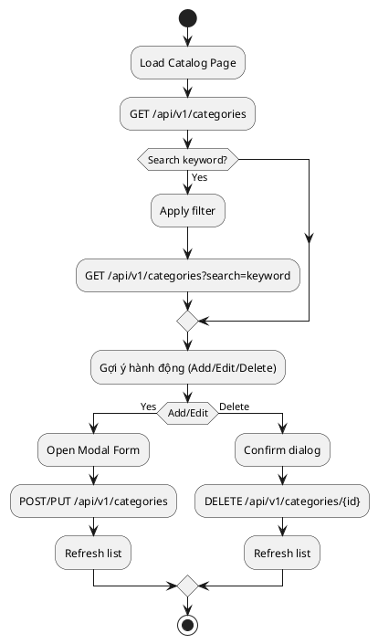

# F04 - Quản Lý Danh Mục

## Mục tiêu
- Quản trị danh mục nền tảng (loại sản phẩm, nguồn nguyên liệu, khu vực bàn...).
- Đảm bảo dữ liệu danh mục đồng bộ với backend và phản ánh realtime trên UI.

## Bối cảnh sử dụng
- Admin/Manager truy cập module `Catalog` thông qua menu điều hướng.
- Mỗi danh mục có thể có các trường tuỳ biến (status, description, priority...).

## Luồng chức năng
1. Người dùng truy cập trang danh mục -> frontend gọi API lấy danh sách.
2. Danh sách hiển thị trong bảng với phân trang, lọc theo từ khóa, trạng thái.
3. Người dùng có thể:
   - Thêm mới danh mục qua modal form.
   - Sửa thông tin bằng cách mở modal chỉnh sửa.
   - Xoá danh mục (soft delete hoặc disable).
4. Sau thao tác CRUD, danh sách cập nhật realtime.

## Sơ đồ hoạt động


## API liên quan
| Method | Endpoint | Mô tả |
|--------|----------|-------|
| GET | `/api/v1/categories` | Lấy danh sách danh mục (hỗ trợ filter, pagination) |
| POST | `/api/v1/categories` | Tạo danh mục mới |
| PUT | `/api/v1/categories/{id}` | Cập nhật danh mục |
| DELETE | `/api/v1/categories/{id}` | Xóa danh mục (soft/hard) |

## Thiết kế UI
- Bảng dữ liệu với các cột: Tên, Mô tả, Trạng thái, Ngày cập nhật, Hành động.
- Toolbar: ô tìm kiếm, dropdown trạng thái, nút thêm mới.
- Modal form tái sử dụng cho thêm/sửa.
- Badge trạng thái (ACTIVE/INACTIVE) rõ màu sắc.

## State & dữ liệu
```json
{
  "catalog": {
    "list": {
      "items": [
        { "id": 1, "name": "Cà phê hạt", "status": "ACTIVE" }
      ],
      "meta": { "page": 1, "size": 20, "total": 120 }
    },
    "filters": {
      "keyword": "",
      "status": "ALL"
    },
    "form": {
      "mode": "create|edit",
      "values": { "name": "", "description": "", "status": "ACTIVE" },
      "errors": {}
    }
  }
}
```

## Checklist triển khai
- [ ] Hỗ trợ debounce tìm kiếm (300ms) để giảm số lần gọi API.
- [ ] Giữ trạng thái phân trang khi quay lại trang (persist query params).
- [ ] Modal form reset khi đóng, kể cả lỗi từ backend.
- [ ] Kiểm soát quyền: chỉ role phù hợp mới thao tác CRUD.
- [ ] Thông báo rõ ràng khi xoá: "Danh mục sẽ bị vô hiệu hoá".

## Test case đề xuất
| ID | Kịch bản | Bước | Kết quả |
|----|----------|------|---------|
| TC-F04-01 | Hiển thị danh sách | Mở trang | Danh sách xuất hiện với pagination |
| TC-F04-02 | Tìm kiếm danh mục | Nhập từ khóa → enter | Danh sách lọc đúng |
| TC-F04-03 | Thêm danh mục | Nhấn thêm → nhập form → lưu | Danh sách cập nhật, toast success |
| TC-F04-04 | Sửa danh mục | Chọn bản ghi → chỉnh sửa → lưu | Thay đổi hiển thị tức thì |
| TC-F04-05 | Xóa danh mục | Nhấn xóa → confirm | Bản ghi biến mất hoặc chuyển trạng thái |

---
**Mức độ hoàn thiện:** 100%
**Hạng mục còn thiếu:** Không
