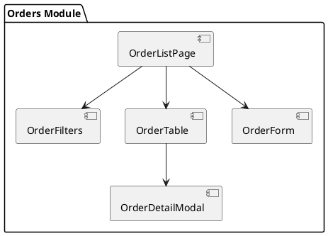

# F05 - Quản Lý Dữ Liệu Nghiệp Vụ

## Mục tiêu
- Quản lý dữ liệu lõi của quán cà phê: sản phẩm, đơn hàng, khách hàng, nhân sự, chấm công.
- Đảm bảo thao tác CRUD thống nhất, phản hồi nhanh và đồng bộ với backend.

## Bối cảnh sử dụng
- Module dành cho Admin/Manager/Nhân viên có quyền.
- Phân chia theo từng sub-module: `Products`, `Orders`, `Customers`, `Staff`, `Attendance`.

## Luồng chức năng chung
1. Người dùng truy cập module (ví dụ `/orders`).
2. Frontend gọi API lấy danh sách dữ liệu với phân trang và bộ lọc.
3. Người dùng thao tác các hành động chính:
   - Xem chi tiết (modal hoặc trang riêng).
   - Thêm mới bản ghi.
   - Chỉnh sửa bản ghi hiện có.
   - Xoá (soft delete hoặc huỷ) bản ghi.
   - Tìm kiếm, lọc, sắp xếp.
4. Sau mỗi hành động, frontend đồng bộ UI (cập nhật list, toast, badge trạng thái).

## Sơ đồ component mẫu (Orders)


## API mẫu (Orders)
| Method | Endpoint | Mô tả |
|--------|----------|-------|
| GET | `/api/v1/orders` | Danh sách đơn hàng (supports `status`, `dateRange`, `page`, `size`) |
| GET | `/api/v1/orders/{id}` | Xem chi tiết đơn hàng |
| POST | `/api/v1/orders` | Tạo đơn hàng mới |
| PUT | `/api/v1/orders/{id}` | Cập nhật đơn |
| DELETE | `/api/v1/orders/{id}` | Huỷ đơn |
| POST | `/api/v1/orders/{id}/payment` | Thanh toán đơn |

## Thiết kế UI chung
- Toolbar gồm bộ lọc, ô tìm kiếm, nút thêm.
- Bảng chính có chọn nhiều dòng (bulk action) nếu cần.
- Modal hoặc drawer hiển thị chi tiết; cho phép chuyển tab (thông tin chung, lịch sử, ghi chú).
- Form sử dụng layout 2 cột, validate realtime.

## State & dữ liệu mẫu
```json
{
  "orders": {
    "list": {
      "items": [
        {
          "id": 1024,
          "code": "ORD-2025-0001",
          "customerName": "Nguyễn Thị B",
          "status": "PROCESSING",
          "totalAmount": 450000,
          "createdAt": "2025-01-15T08:30:00"
        }
      ],
      "meta": { "page": 1, "size": 20, "total": 85 }
    },
    "filters": {
      "keyword": "",
      "status": "ALL",
      "dateRange": ["2025-01-01", "2025-01-31"]
    },
    "selection": {
      "selectedIds": [1024]
    }
  }
}
```

## Checklist triển khai
- [ ] Mỗi sub-module có service riêng và tái sử dụng hook chung (`useCrudModule`).
- [ ] Đồng bộ trạng thái sau CRUD bằng cách refetch hoặc cập nhật cục bộ.
- [ ] Hiển thị badge trạng thái (ví dụ đơn hàng: `PENDING`, `PROCESSING`, `COMPLETED`).
- [ ] Hỗ trợ export dữ liệu (CSV/Excel) nếu backend cho phép.
- [ ] Ghi log hành động quan trọng (tối thiểu trên client và gửi tới backend nếu yêu cầu).

## Test case đề xuất
| ID | Kịch bản | Bước | Kết quả |
|----|----------|------|---------|
| TC-F05-01 | Xem danh sách | Mở module | Danh sách hiển thị đúng, phân trang hoạt động |
| TC-F05-02 | Thêm mới | Click "Thêm" → nhập form → lưu | Bản ghi mới xuất hiện, toast success |
| TC-F05-03 | Sửa bản ghi | Chọn bản ghi → chỉnh → lưu | Thông tin cập nhật đúng |
| TC-F05-04 | Huỷ đơn | Chọn đơn → nhấn huỷ → xác nhận | Trạng thái đổi sang `CANCELED` |
| TC-F05-05 | Bộ lọc | Chọn trạng thái `COMPLETED` | Danh sách chỉ hiện đơn hoàn tất |

---
**Mức độ hoàn thiện:** 100%
**Hạng mục còn thiếu:** Không
