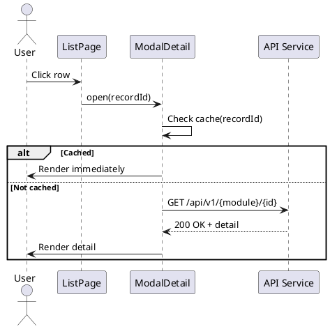

# F06 - Modal Chi Tiết

## Mục tiêu
- Hiển thị thông tin chi tiết của bản ghi mà không cần chuyển trang.
- Cho phép chỉnh sửa nhanh hoặc thực hiện hành động bổ sung.

## Bối cảnh sử dụng
- Mở từ danh sách chính (Orders, Products, Customers...).
- Người dùng click vào dòng hoặc nút "Xem chi tiết".

## Luồng chức năng
1. Người dùng kích hoạt modal chi tiết.
2. Frontend kiểm tra cache theo `recordId`; nếu chưa có thì gọi API chi tiết.
3. Sau khi nhận dữ liệu, modal render các tab thông tin (chi tiết, lịch sử, ghi chú).
4. Cho phép chỉnh sửa inline hoặc mở form cập nhật.
5. Đóng modal khi người dùng nhấn Close hoặc ESC.

## Sơ đồ tuần tự


## API liên quan
| Method | Endpoint | Mô tả |
|--------|----------|-------|
| GET | `/api/v1/{module}/{id}` | Lấy chi tiết bản ghi |
| GET | `/api/v1/{module}/{id}/timeline` | Lịch sử hoạt động (nếu có) |

## Thiết kế UI
- Modal width 720px (desktop), full-screen (mobile).
- Header hiển thị tiêu đề + trạng thái.
- Body có tab hoặc accordion cho từng nhóm thông tin.
- Footer: nút đóng, nút chỉnh sửa/đồng ý.

## State & dữ liệu
```json
{
  "detailModal": {
    "isOpen": true,
    "module": "orders",
    "recordId": 1024,
    "data": {
      "order": {
        "code": "ORD-2025-0001",
        "status": "PROCESSING",
        "customer": "Nguyễn Thị B",
        "items": [
          { "product": "Latte", "qty": 2 }
        ],
        "timeline": [
          { "time": "2025-01-15T08:30", "action": "Tạo đơn" }
        ]
      }
    }
  }
}
```

## Checklist triển khai
- [ ] Sử dụng portal để render modal và trap focus để đảm bảo accessibility.
- [ ] Cho phép đóng bằng ESC và click overlay (có tuỳ chọn bật/tắt).
- [ ] Loader skeleton khi chờ dữ liệu.
- [ ] Cache detail theo ID để mở lại nhanh.
- [ ] Hook `useDetailModal(module)` để tái sử dụng giữa các module.

## Test case đề xuất
| ID | Kịch bản | Bước | Kết quả |
|----|----------|------|---------|
| TC-F06-01 | Mở modal lần đầu | Click bản ghi | Modal hiển thị sau khi data load |
| TC-F06-02 | Mở lại modal đã cache | Mở lại bản ghi cũ | Modal hiển thị ngay lập tức |
| TC-F06-03 | Đóng modal bằng ESC | Nhấn ESC | Modal đóng, focus trả về danh sách |
| TC-F06-04 | Lỗi API chi tiết | Backend trả 404 | Hiển thị thông báo lỗi và đóng modal |

---
**Mức độ hoàn thiện:** 100%
**Hạng mục còn thiếu:** Không
