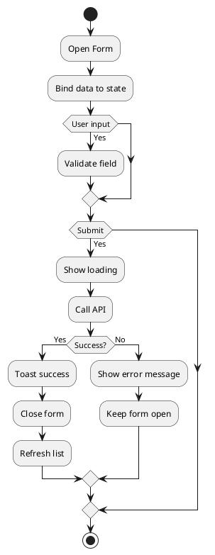

# F07 - Form Xử Lý

## Mục tiêu
- Cung cấp trải nghiệm nhập liệu nhanh, chính xác, ít lỗi.
- Tái sử dụng cho nhiều module (sản phẩm, khách hàng, đơn hàng...).

## Bối cảnh sử dụng
- Dùng trong modal, trang riêng hoặc drawer cho hành động thêm/sửa.
- Hỗ trợ validate realtime và phản hồi người dùng rõ ràng.

## Luồng chức năng
1. Người dùng mở form để nhập dữ liệu.
2. Form đồng bộ giá trị với state (controlled form hoặc form library).
3. Validate realtime: required, định dạng, ràng buộc tùy chỉnh.
4. Khi submit: hiển thị trạng thái loading, disable nút.
5. Gửi request API tương ứng (POST/PUT) và xử lý response.
6. Hiển thị toast thành công hoặc lỗi; đóng form và cập nhật danh sách.

## Sơ đồ hoạt động


## UI/UX Guidelines
- Sử dụng layout rõ ràng, nhóm các trường liên quan.
- Label bên trái, mô tả validation dưới input.
- Highlight trường lỗi với viền/ màu sắc và icon cảnh báo.
- Sử dụng component input tái sử dụng (TextField, Select, DatePicker).
- Có nút "Huỷ" để đóng form và reset giá trị.

## State & dữ liệu mẫu
```json
{
  "form": {
    "values": {
      "name": "Americano",
      "price": 45000,
      "categoryId": 3,
      "status": "ACTIVE"
    },
    "errors": {
      "name": null,
      "price": null
    },
    "meta": {
      "mode": "create",
      "isSubmitting": false
    }
  }
}
```

## Checklist triển khai
- [ ] Sử dụng form library (React Hook Form / VeeValidate) cho hiệu năng tốt.
- [ ] Validate trước khi submit và hiển thị thông điệp cụ thể.
- [ ] Hỗ trợ reset và autofill (ví dụ: copy từ bản ghi khác).
- [ ] Chặn submit khi form không hợp lệ.
- [ ] Map lỗi backend trả về cho từng trường (field-level error).

## Test case đề xuất
| ID | Kịch bản | Bước | Kết quả |
|----|----------|------|---------|
| TC-F07-01 | Submit thành công | Nhập hợp lệ → submit | API trả 200/201, form đóng |
| TC-F07-02 | Lỗi validate client | Để trống trường required → submit | Hiển thị lỗi dưới trường |
| TC-F07-03 | Lỗi backend | API trả 400 với field error | Form hiển thị lỗi tương ứng |
| TC-F07-04 | Reset form | Nhấn "Huỷ" | Giá trị form trở về ban đầu |

---
**Mức độ hoàn thiện:** 100%
**Hạng mục còn thiếu:** Không
