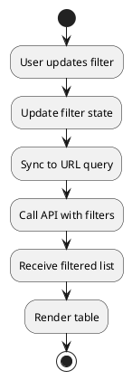

# F08 - Tìm Kiếm - Lọc - Sắp Xếp

## Mục tiêu
- Giúp người dùng nhanh chóng tìm thấy dữ liệu mong muốn.
- Cho phép kết hợp nhiều tùy chọn lọc và sắp xếp linh hoạt.

## Bối cảnh sử dụng
- Áp dụng cho mọi danh sách (orders, products, staff, customers...).
- Bộ lọc hiển thị phía trên bảng dữ liệu hoặc trong sidebar.

## Luồng chức năng
1. Người dùng nhập từ khóa hoặc chọn bộ lọc.
2. Frontend cập nhật state `filters` và đẩy query vào URL (để share/link lại).
3. Gọi API với query tương ứng (`/api/v1/{module}?keyword=...&status=...`).
4. Backend trả về danh sách đã lọc -> cập nhật UI.
5. Khi thay đổi sắp xếp, frontend cập nhật `sortField`, `sortOrder` và gọi API.

## Sơ đồ hoạt động


## API liên quan
| Method | Endpoint | Tham số |
|--------|----------|---------|
| GET | `/api/v1/orders` | `keyword`, `status`, `dateFrom`, `dateTo`, `sort`, `page`, `size` |
| GET | `/api/v1/products` | `keyword`, `category`, `priceRange`, `sort` |

## UI/UX Guidelines
- Input search với placeholder rõ ràng, có icon search.
- Button "Lọc nâng cao" mở panel với nhiều điều kiện.
- Dropdown cho sort (Mới nhất, Cũ nhất, Giá tăng dần...).
- Tag hiển thị filter đang áp dụng, cho phép xoá nhanh.
- Nút "Xoá tất cả" để reset bộ lọc.

## State & dữ liệu mẫu
```json
{
  "filters": {
    "keyword": "americano",
    "status": "PROCESSING",
    "dateRange": ["2025-01-01", "2025-01-31"],
    "sort": {
      "field": "createdAt",
      "order": "desc"
    },
    "page": 1,
    "size": 20
  }
}
```

## Checklist triển khai
- [ ] Debounce input search (300-500ms) để tối ưu API call.
- [ ] Đồng bộ filter với URL (`?keyword=&status=`) để chia sẻ trạng thái.
- [ ] Lưu filter vào store để giữ khi điều hướng sang trang chi tiết và quay lại.
- [ ] Hỗ trợ nhiều điều kiện lọc cùng lúc (AND logic).
- [ ] Hiển thị placeholder "Không tìm thấy dữ liệu" khi kết quả rỗng.

## Test case đề xuất
| ID | Kịch bản | Bước | Kết quả |
|----|----------|------|---------|
| TC-F08-01 | Tìm kiếm keyword | Nhập "Latte" → enter | Danh sách chỉ còn bản ghi chứa "Latte" |
| TC-F08-02 | Lọc trạng thái | Chọn `COMPLETED` | Danh sách lọc đúng |
| TC-F08-03 | Sắp xếp | Chọn "Giá giảm dần" | Bảng sắp xếp đúng thứ tự |
| TC-F08-04 | Reset filter | Nhấn "Xoá tất cả" | Trả về trạng thái mặc định |
| TC-F08-05 | Share URL | Copy URL với query → mở tab mới | Bộ lọc được khôi phục |

---
**Mức độ hoàn thiện:** 100%
**Hạng mục còn thiếu:** Không
