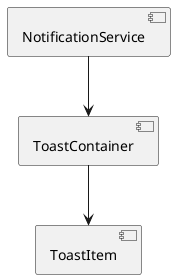

# F09 - Thông Báo & Toast

## Mục tiêu
- Gửi phản hồi tức thì cho người dùng khi thao tác thành công hoặc thất bại.
- Hỗ trợ hiển thị cảnh báo, xác nhận, nhắc nhở thao tác tiếp theo.

## Bối cảnh sử dụng
- Toast xuất hiện ở góc trên bên phải (desktop) hoặc dưới (mobile) khi có sự kiện quan trọng.
- Có thể được kích hoạt từ bất kỳ module nào sau khi xử lý API.

## Luồng chức năng
1. Service `NotificationService` nhận yêu cầu hiển thị toast.
2. Thêm phần tử vào `toastQueue` trong store.
3. Component `ToastContainer` render toast theo kiểu.
4. Toast tự động biến mất sau 4 giây hoặc khi người dùng đóng.
5. Hỗ trợ hành động phụ (undo, xem chi tiết) nếu được cấu hình.

## Sơ đồ component


## UI/UX Guidelines
- Toast có icon tùy loại: success (✔️), error (⚠️), info (ℹ️), warning (!).
- Tối đa 3 toast hiển thị cùng lúc, các toast cũ biến mất khi vượt giới hạn.
- Với hành động quan trọng (delete), cung cấp nút "Undo".
- Tránh che khuất nội dung chính (offset 16px từ viền).

## State & dữ liệu
```json
{
  "ui": {
    "toastQueue": [
      {
        "id": "toast-123",
        "type": "success",
        "message": "Tạo đơn hàng thành công",
        "action": {
          "label": "Xem",
          "href": "/orders/1024"
        }
      }
    ]
  }
}
```

## Checklist triển khai
- [ ] Sử dụng hook `useToast()` để gọi gọn `toast.success(message)`.
- [ ] Tạo queue FIFO, tự động remove sau timeout.
- [ ] Cho phép cấu hình vị trí toast thông qua theme (top-right, bottom-left...).
- [ ] Hỗ trợ pause timeout khi hover để người dùng đọc.
- [ ] Đảm bảo toast có thể render offline (không phụ thuộc API).

## Test case đề xuất
| ID | Kịch bản | Bước | Kết quả |
|----|----------|------|---------|
| TC-F09-01 | Hiển thị toast thành công | Gọi `toast.success("OK")` | Toast hiển thị và biến mất sau 4 giây |
| TC-F09-02 | Nhiều toast liên tiếp | Gọi 5 lần | Chỉ hiển thị tối đa 3, các toast cũ biến mất |
| TC-F09-03 | Hành động phụ | Toast với `action` | Nút hiển thị, click điều hướng đúng |
| TC-F09-04 | Pause khi hover | Di chuột vào toast | Toast không biến mất cho đến khi rời chuột |

---
**Mức độ hoàn thiện:** 100%
**Hạng mục còn thiếu:** Không
