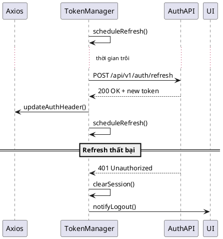

# F10 - Quản Lý Phiên Đăng Nhập

## Mục tiêu
- Duy trì trạng thái đăng nhập ổn định, tự động làm mới token khi sắp hết hạn.
- Ngăn chặn việc sử dụng token hết hạn gây lỗi trải nghiệm.

## Bối cảnh sử dụng
- Người dùng đã đăng nhập và đang thao tác trong hệ thống.
- Frontend phải theo dõi thời gian sống của `accessToken` và `refreshToken`.

## Luồng chức năng
1. Khi đăng nhập thành công, store lưu `accessToken`, `refreshToken`, `expiresAt`.
2. Thiết lập scheduler (setTimeout hoặc background task) để gọi refresh trước khi token hết hạn (ví dụ 1 phút).
3. Khi scheduler kích hoạt:
   - Gửi request `POST /api/v1/auth/refresh` với `refreshToken`.
   - Nếu thành công: cập nhật token mới và đặt lại scheduler.
   - Nếu thất bại (401/403): thông báo người dùng và chuyển về trang đăng nhập.
4. Chặn các request API đang chờ trong lúc refresh để tránh lỗi 401 chéo.

## Sơ đồ tuần tự


## API liên quan
| Method | Endpoint | Mô tả |
|--------|----------|-------|
| POST | `/api/v1/auth/refresh` | Làm mới accessToken bằng refreshToken |
| POST | `/api/v1/auth/logout` | (Tuỳ chọn) Invalidate refresh token phía backend |

## State & dữ liệu
```json
{
  "auth": {
    "accessToken": "eyJhb...",
    "refreshToken": "def456...",
    "expiresAt": 1736995200,
    "refreshStatus": "idle|refreshing|failed"
  }
}
```

## Checklist triển khai
- [ ] Wrapper Axios queue requests khi refresh đang diễn ra.
- [ ] Kiểm tra `expiresAt` mỗi lần chuyển route để refresh chủ động.
- [ ] Nếu backend trả về 401 khi refresh → clear token, điều hướng `/login`.
- [ ] Thêm thông báo "Phiên làm việc đã hết hạn" để người dùng biết.
- [ ] Lưu ý bảo mật: refresh token ưu tiên lưu trong HTTPOnly cookie.

## Test case đề xuất
| ID | Kịch bản | Bước | Kết quả |
|----|----------|------|---------|
| TC-F10-01 | Refresh thành công | Chờ gần hết hạn → trigger | Token mới cập nhật, user tiếp tục thao tác |
| TC-F10-02 | Refresh thất bại | Sử dụng refresh token hết hạn | Hiển thị thông báo, chuyển về login |
| TC-F10-03 | Queue request | Trigger refresh khi đang có API khác | Request được gửi lại sau khi refresh |
| TC-F10-04 | Multi-tab | Logout ở tab A | Tab B nhận sự kiện và logout |

---
**Mức độ hoàn thiện:** 100%
**Hạng mục còn thiếu:** Không
