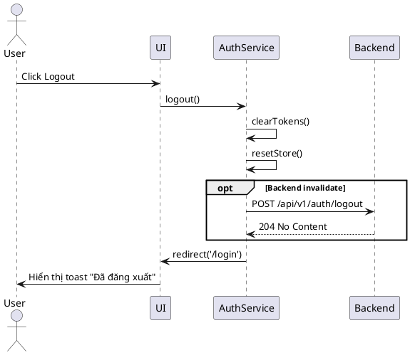

# F11 - Logout

## Mục tiêu
- Kết thúc phiên làm việc an toàn cho người dùng.
- Xoá toàn bộ token và dữ liệu tạm trên client, đảm bảo không thể tiếp tục truy cập.

## Bối cảnh sử dụng
- Người dùng chủ động chọn "Đăng xuất" từ menu.
- Phiên hết hạn khiến hệ thống buộc phải logout.
- Được kích hoạt từ sự kiện broadcast (đa tab).

## Luồng chức năng
1. Người dùng click nút Logout hoặc nhận thông báo hết phiên.
2. Frontend gọi `AuthService.logout()`:
   - Xoá `accessToken`, `refreshToken` khỏi storage.
   - Clear state store (`auth`, `entities`, `filters`).
   - Gửi request `POST /api/v1/auth/logout` (nếu backend hỗ trợ huỷ refresh token).
3. Phát sự kiện `session-ended` qua `BroadcastChannel` hoặc `localStorage` để các tab khác đồng bộ logout.
4. Điều hướng người dùng về `/login` và hiển thị toast thông báo.

## Sơ đồ tuần tự


## API liên quan
| Method | Endpoint | Mô tả |
|--------|----------|-------|
| POST | `/api/v1/auth/logout` | (Tuỳ chọn) Invalidate refresh token trên backend |

## UI/UX Guidelines
- Nút logout đặt ở menu user dropdown phía trên.
- Hiển thị modal xác nhận nếu có hành động chưa lưu.
- Thể hiện trạng thái đang logout (spinner ngắn) nếu gọi API.
- Toast thông báo: "Bạn đã đăng xuất. Hẹn gặp lại!".

## State & dữ liệu
```json
{
  "auth": {
    "accessToken": null,
    "refreshToken": null,
    "profile": null
  },
  "ui": {
    "toastQueue": [
      { "type": "info", "message": "Bạn đã đăng xuất" }
    ]
  }
}
```

## Checklist triển khai
- [ ] Clear toàn bộ storage (`localStorage`, `sessionStorage`, `cookies`) liên quan phiên.
- [ ] Reset store và invalidate query cache (React Query/RTK Query) để tránh rò dữ liệu.
- [ ] Phát broadcast để các tab khác cùng logout.
- [ ] Điều hướng `/login` và ngăn trở lại trang trước (replace history).
- [ ] Nếu backend không hỗ trợ logout API, đảm bảo token bị xoá vẫn đủ bảo mật.

## Test case đề xuất
| ID | Kịch bản | Bước | Kết quả |
|----|----------|------|---------|
| TC-F11-01 | Logout thủ công | Click logout | Token bị xoá, chuyển về login |
| TC-F11-02 | Đồng bộ đa tab | Logout tab A | Tab B tự động logout |
| TC-F11-03 | Logout khi token hết hạn | Backend trả 401 | Frontend clear session, toast thông báo |
| TC-F11-04 | Ngăn quay lại | Logout xong → nhấn Back | Trình duyệt ở trang login, không vào dashboard |

---
**Mức độ hoàn thiện:** 100%
**Hạng mục còn thiếu:** Không
