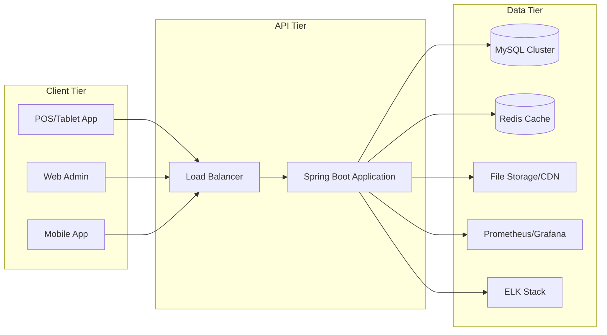
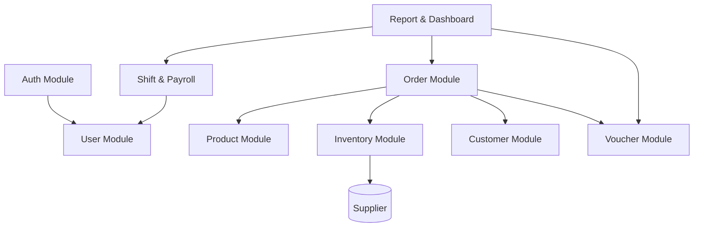

# Kiến Trúc Tổng Thể

## Kiến trúc logic
Hệ thống áp dụng kiến trúc phân lớp truyền thống, dễ bảo trì và mở rộng:
1. **Presentation Layer (Controller)**: Xử lý request/response, xác thực đầu vào, trả dữ liệu DTO.
2. **Service Layer**: Chứa logic nghiệp vụ, điều phối các repository và service khác, đảm bảo tính toàn vẹn giao dịch.
3. **Repository Layer**: Giao tiếp với cơ sở dữ liệu thông qua Spring Data JPA.
4. **Domain Layer**: Chứa entity, enum, giá trị chuẩn hóa.
5. **Infrastructure Layer**: Cấu hình bảo mật, cấu hình OpenAPI, phát sinh dữ liệu, xử lý file.

## Kiến trúc triển khai

## Thành phần chính
- **Spring Boot**: Ứng dụng chính, triển khai REST API.
- **Spring Security**: Bảo mật, JWT, phân quyền.
- **Spring Data JPA**: Truy cập dữ liệu, mapping ORM.
- **MapStruct**: Ánh xạ DTO – Entity.
- **MySQL**: Cơ sở dữ liệu quan hệ chính.
- **Redis (tùy chọn)**: Cache voucher, danh mục sản phẩm.
- **ELK/Prometheus (tùy chọn)**: Ghi log, giám sát.
- **Docker**: Đóng gói ứng dụng, triển khai linh hoạt.

## Mô hình module nội bộ

## Giao tiếp nội bộ
- Các module trong cùng ứng dụng giao tiếp thông qua service interface.
- Sử dụng sự kiện nội bộ (ApplicationEvent) để xử lý hậu kỳ (ví dụ ghi audit log) nếu cần.
- Giao tiếp bất đồng bộ có thể bổ sung bằng message queue (RabbitMQ/Kafka) khi mở rộng.

## Môi trường triển khai
| Môi trường | Mục đích | Đặc điểm |
|------------|----------|----------|
| Dev | Phát triển nội bộ | Sử dụng profile `dev`, H2 hoặc MySQL local, bật Swagger UI |
| Staging | Kiểm thử tích hợp | Dữ liệu gần giống production, có backup định kỳ |
| Production | Vận hành thực tế | Triển khai Docker, kết nối MySQL cluster, bật bảo mật đầy đủ |

## Bảo mật kiến trúc
- Reverse proxy (Nginx/Traefik) phía trước để hỗ trợ HTTPS và rate limiting.
- JWT lưu trong header Authorization, refresh token lưu trong cookie bảo mật (tuỳ chọn).
- Tường lửa kiểm soát luồng từ public đến API, chỉ mở port cần thiết.
- Mã hóa dữ liệu nhạy cảm ở DB (ví dụ thông tin thanh toán nếu được lưu).

## Khả năng mở rộng
- Tách module Order và Inventory thành microservice khi lưu lượng lớn.
- Dùng shared database hoặc mỗi service một schema tuỳ mô hình.
- Tận dụng cache và queue để giảm tải DB.
