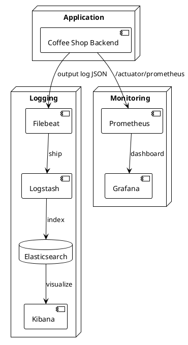

# Logging & Monitoring

## Mục lục
- [1. Mục tiêu](#1-mục-tiêu)
- [2. Kiến trúc quan sát](#2-kiến-trúc-quan-sát)
- [3. Logging](#3-logging)
- [4. Monitoring & Metrics](#4-monitoring--metrics)
- [5. Alerting](#5-alerting)
- [6. Theo dõi tracing](#6-theo-dõi-tracing)
- [7. Kịch bản vận hành](#7-kịch-bản-vận-hành)

## 1. Mục tiêu
- Thu thập log và metric thống nhất, dễ truy vết sự cố.
- Cung cấp dashboard realtime cho vận hành đánh giá sức khỏe hệ thống.
- Thiết lập cảnh báo tự động khi vượt ngưỡng SLA/SLI.

## 2. Kiến trúc quan sát

## 3. Logging
- Định dạng JSON (`timestamp`, `level`, `logger`, `message`, `traceId`, `userId`).
- Sử dụng SLF4J + Logback với pattern encoder JSON (Logstash).
- Mức log:
  - `ERROR`: lỗi nghiệp vụ/sự cố.
  - `WARN`: bất thường có thể ảnh hưởng.
  - `INFO`: sự kiện chính (tạo đơn, thanh toán, login).
  - `DEBUG`: bật khi cần điều tra (dev/staging).
- Lưu file local: `logs/application.log`, rotate daily, 30 bản ghi.
- Vận chuyển log: Filebeat → ELK.
- Mask dữ liệu nhạy cảm (`password`, `token`).
- Audit log: ghi vào bảng `audit_logs` (JSON payload).

## 4. Monitoring & Metrics
- Expose `/actuator/prometheus` (Spring Micrometer) với metric mặc định.
- Metric chính:
  - HTTP request (`http_server_requests_seconds`).
  - Database (`hikaricp_connections_active`, `spring.datasource.hikari.pool.usage`).
  - Business metric: `orders_created_total`, `voucher_validate_failed_total` (custom counter).
- Dashboard Grafana:
  - Tốc độ phản hồi (p50/p95/p99).
  - Tỷ lệ lỗi 4xx/5xx.
  - CPU, RAM, heap.
  - Thực thi job (báo cáo).

## 5. Alerting
- Prometheus Alertmanager gửi cảnh báo tới Slack `#coffee-backend-alert`.
- Ngưỡng đề xuất:
  - `http_5xx_rate > 1%` trong 5 phút → Critical.
  - `login_failed_total > 20` trong 10 phút → Warning.
  - `orders_pending > 50` trong 10 phút → Warning.
  - Database connection usage > 80% trong 5 phút → Critical.
- Email alert cho đội vận hành khi downtime > 2 phút.

## 6. Theo dõi tracing
- Sử dụng Spring Cloud Sleuth/ Micrometer Tracing + OpenTelemetry exporter (tùy chọn).
- Đính `traceId`, `spanId` vào log.
- Lưu trace vào Jaeger/Tempo (khi triển khai microservice).

## 7. Kịch bản vận hành
- Sự cố log: kiểm tra Filebeat/Logstash service, đảm bảo quyền file.
- Metric không cập nhật: kiểm tra `/actuator/prometheus`, cấu hình scrape Prometheus.
- Lưu trữ: Elasticsearch rollover sau 30 ngày, snapshot sang S3.
- Kiểm tra định kỳ: dashboard, alert rules, script backup log.

---
**Mức độ hoàn thiện:** 100%
**Hạng mục còn thiếu:** Không
