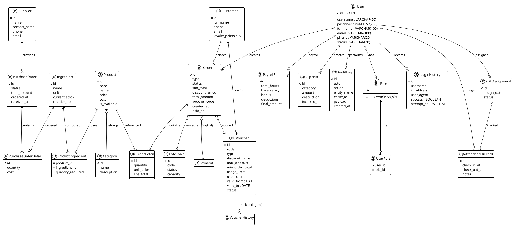

# Mô Hình Dữ Liệu

## Mục lục
- [1. Lược đồ ER tổng thể](#1-lược-đồ-er-tổng-thể)
- [2. Nhóm thực thể chính](#2-nhóm-thực-thể-chính)
- [3. Chuẩn dữ liệu & quy ước](#3-chuẩn-dữ-liệu--quy-ước)
- [4. Ràng buộc & chỉ mục](#4-ràng-buộc--chỉ-mục)
- [5. Mapping Entity–DTO–API](#5-mapping-entitydtoapi)

## 1. Lược đồ ER tổng thể

## 2. Nhóm thực thể chính
- **User/Role/UserRole**: Quản lý người dùng nội bộ, phân quyền bằng bảng trung gian.
- **Order/OrderDetail/Voucher/CafeTable**: Nghiệp vụ bán hàng tại quán, lưu số liệu tài chính và áp dụng khuyến mãi.
- **Product/Category/ProductIngredient/Ingredient**: Danh mục sản phẩm, công thức pha chế và tồn kho nguyên liệu.
- **PurchaseOrder/PurchaseOrderDetail/Supplier**: Quy trình nhập hàng, đối soát nhà cung cấp.
- **Customer/Voucher**: Quan hệ khách hàng – loyalty – phân phối voucher.
- **ShiftAssignment/AttendanceRecord/PayrollSummary**: Ghi nhận ca làm, chấm công, tính toán lương.
- **Expense/AuditLog/LoginHistory**: Hỗ trợ kế toán và tuân thủ audit.

## 3. Chuẩn dữ liệu & quy ước
- Khóa chính sử dụng `BIGINT AUTO_INCREMENT` (MySQL) hoặc `IDENTITY`.
- Múi giờ lưu trong DB là UTC; khi hiển thị sử dụng `Asia/Ho_Chi_Minh`.
- Field tài chính (`price`, `amount`, `total`) dùng `DECIMAL(12,2)`.
- Chuẩn hóa trạng thái bằng enum trong code + cột VARCHAR (ví dụ: `order.status` ∈ {PENDING, PAID, CANCELLED}).
- Chuẩn hóa tên bảng `snake_case`, cột `snake_case` (chi tiết trong `thiet-ke-bang.md`).

## 4. Ràng buộc & chỉ mục
- Ràng buộc NOT NULL với các trường bắt buộc (`username`, `order.status`, ...).
- Unique index:
  - `users(username)`, `users(email)`
  - `products(code)`, `vouchers(code)`
  - `customers(phone)`
- Index hiệu năng:
  - `orders(created_at)`, `orders(status)`
  - `order_details(product_id)`
  - `attendance_records(user_id, check_in_at)`
- Quan hệ cascade:
  - `orders` cascade `order_details`
  - `purchase_orders` cascade `purchase_order_details`
  - `users` cascade `login_history` (delete orphan)

## 5. Mapping Entity–DTO–API
| Entity | DTO chính | Endpoint tham chiếu |
|--------|-----------|---------------------|
| User | `UserResponseDTO`, `CreateUserRequestDTO` | `/api/v1/users` |
| Order | `OrderResponseDTO`, `OrderCreateRequestDTO` | `/api/v1/orders` |
| Voucher | `VoucherResponseDTO`, `VoucherRequestDTO` | `/api/v1/vouchers` |
| Product | `ProductResponseDTO`, `ProductRequestDTO` | `/api/v1/products` |
| PurchaseOrder | `PurchaseOrderDTO`, `PurchaseOrderRequest` | `/api/v1/purchase-orders` |
| AttendanceRecord | `AttendanceDTO` | `/api/v1/attendance` |
| PayrollSummary | `PayrollSummaryDTO` | `/api/v1/payroll` |

Ánh xạ được thực hiện bằng MapStruct (`OrderMapper`, `VoucherMapper`, …); validation dựa trên Jakarta Validation (`@NotBlank`, `@Positive`, `@FutureOrPresent`...).

---
**Mức độ hoàn thiện:** 100%
**Hạng mục còn thiếu:** Không
