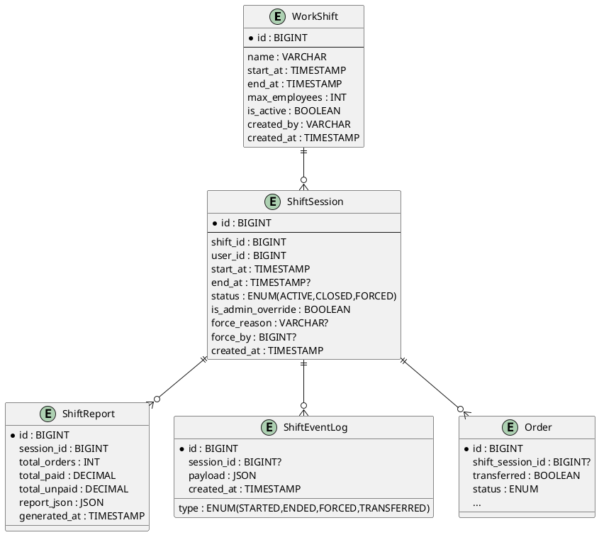
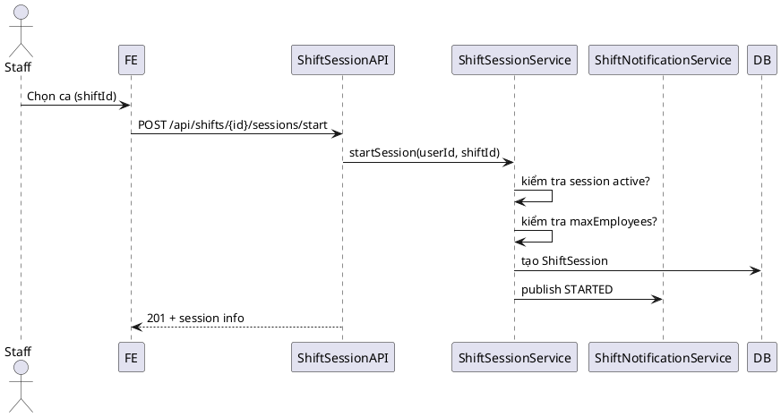
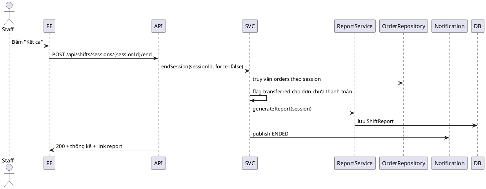

# Sprint 1 – Phân tích & Thiết kế lại tính năng Quản lý Ca làm việc

> **Mục tiêu**: Đánh giá hiện trạng module ca làm việc, xác định khoảng cách so với yêu cầu nghiệp vụ mới (vào ca/kết ca, quản lý đơn hàng, realtime cho admin/manager), và đề xuất kiến trúc triển khai an toàn theo nhiều sprint.

---

## 1. Hiện trạng hệ thống

### 1.1 Cơ sở dữ liệu sẵn có
- **shift_templates**: cấu hình ca chuẩn (giờ bắt đầu/kết thúc, rate mặc định...).
- **shift_instances**: ca cụ thể theo ngày (status, locked_at...).
- **shift_assignments**: nhân viên được phân ca, bao gồm payroll metrics.
- **attendance_records**, **shift_performance_adjustments**: chấm công & điều chỉnh lương.

Các bảng này phục vụ bài toán nhân sự/payroll. Chưa có khái niệm *session vào ca* linh hoạt theo yêu cầu POS.

### 1.2 Dịch vụ & luồng hiện có
- `ShiftAssignmentServiceImpl`: xử lý tạo assignment, tính toán lương dựa trên order đã thanh toán.
- `AttendanceServiceImpl`: chấm công theo assignment.
- Chưa có API cho nhân viên *tự vào ca/kết ca* theo thời gian thực.
- Order hiện chỉ gắn `user` & `table`, chưa liên kết ca.

### 1.3 Khoảng cách với yêu cầu mới
| Hạng mục | Hiện trạng | Yêu cầu mới |
| --- | --- | --- |
| Vào ca linh hoạt | Cần tạo assignment trước | Nhân viên đăng nhập → chọn ca, kiểm tra max slot |
| Quyền order | Chỉ dựa vào role | Phải kiểm tra session active (trừ admin/manager) |
| Chuyển đơn chưa thanh toán | Không có | Kết ca → chuyển giao đơn cho ca khác |
| Báo cáo ca | Payroll tổng hợp | Tổng hợp đơn (đã/ chưa thanh toán), PDF & thermal |
| Realtime notify | Không có | WebSocket báo cho admin/manager |

---

## 2. Yêu cầu nghiệp vụ đã thống nhất
1. **Admin**: toàn quyền (cấu hình ca, force end, order không cần ca).
2. **Manager**: giống admin **trừ** tạo/ chỉnh sửa ca.
3. **Staff**: phải `Vào ca` (nếu slot còn), mới được order; `Kết ca` để chốt doanh thu.
4. Oder chưa thanh toán khi kết ca phải flag *transferred* và chờ ca khác nhận.
5. Báo cáo kết ca xuất được 2 định dạng: PDF A4, thermal 58/80mm.
6. Realtime notification cho admin/manager khi có người vào/kết ca.
7. Không auto-end, không bắt buộc theo template cố định.

---

## 3. Kiến trúc đề xuất

### 3.1 Mô hình thực thể


### 3.2 Các lớp service
- `ShiftService`: CRUD WorkShift (Admin), list shifts cho frontend chọn.
- `ShiftSessionService`: start/end/force session, chuyển order, lấy session hiện tại.
- `ShiftReportService`: kết ca → tổng hợp số liệu, lưu report, xuất file.
- `ShiftNotificationService`: publish event tới `/topic/shifts` (STOMP).

### 3.3 Phân quyền
| API | Role | Ghi chú |
| --- | --- | --- |
| Tạo/ cập nhật WorkShift | ADMIN | Manager không được |
| Vào ca | STAFF, MANAGER, ADMIN | Kiểm tra `max_employees`; Admin set `is_admin_override=true` |
| Kết ca | Chủ session | Manager/Admin có thể force end |
| Force end | ADMIN, MANAGER | Lưu `force_reason`, event `FORCED` |
| Order | ADMIN/MANAGER luôn được; STAFF phải có session ACTIVE |

---

## 4. Quy trình chính

### 4.1 Vào ca (Staff/Manager)


### 4.2 Kết ca tự nguyện


---

## 5. Kế hoạch Migration (dự kiến Sprint 2)
1. **Bước chuẩn bị**: backup bảng liên quan; viết script chuyển đổi nếu cần.
2. **Migration chính**:
   - Tạo bảng `work_shifts`, `shift_sessions`, `shift_reports`, `shift_event_logs`.
   - Alter `orders` thêm cột `shift_session_id`, `transferred` (default false).
   - Index: `orders.shift_session_id`, `shift_sessions.status`, `shift_sessions.user_id`.
3. **Seed dữ liệu**: convert `shift_instances` active thành `work_shifts` (nếu còn dùng), `shift_assignments` sang `shift_sessions` (tham khảo: session start/end = plannedStart/End).
4. **Rollback**: drop bảng mới, revert cột `orders`.

---

## 6. JSON cấu hình prototype cho FE
```json
{
  "shiftSelection": {
    "autoRefreshMs": 15000,
    "maxDisplay": 5,
    "showCapacity": true
  },
  "session": {
    "reconnectDelayMs": 5000,
    "forceEndReasonRequired": true
  },
  "report": {
    "defaultFormat": "pdf",
    "thermal": {
      "width": 58,
      "header": "Quán Cà Phê Giapo"
    }
  }
}
```

---

## 7. Danh sách Test dự kiến
| Nhóm | Test case |
| --- | --- |
| Unit | startSession: ca full, user đã active, admin override; endSession: tổng hợp đơn & chuyển giao |
| Integration | Flow vào ca → tạo order → kết ca → tải báo cáo |
| Security | Order API trả 403 khi staff chưa vào ca |
| Realtime | Admin nhận event STARTED/ENDED qua STOMP |
| Report | Snapshot PDF/thermal (golden files) |
| Concurrency | 2 nhân viên cùng bấm vào ca khi chỉ còn 1 slot |

---

## 8. Rủi ro & Biện pháp
| Rủi ro | Ảnh hưởng | Giải pháp |
| --- | --- | --- |
| Xung đột schema với module payroll | Lỗi build/test | Mapping migration giữ nguyên bảng cũ, chỉ thêm bảng mới |
| Token handshake WS cũ | Mất realtime | Tái sử dụng `JwtHandshakeInterceptor`, thêm topic mới |
| Đơn chưa thanh toán chuyển giao bị mất | Thất thoát doanh thu | Transaction wrap trong `endSession` + test integration |
| Chi phí phát triển báo cáo | Trễ tiến độ | Ưu tiên thermal (txt) trước, PDF dùng template tối giản |

---

## 9. Lộ trình các sprint tiếp theo (đề xuất)
1. **Sprint 2**: Migration + entity + service cơ bản (start/end/force session, attach order).
2. **Sprint 3**: REST controller + security middleware + unit/integration test.
3. **Sprint 4**: Realtime (STOMP) + FE hook + transfer order API.
4. **Sprint 5**: Report generator PDF/thermal, monitoring & tài liệu FE.

---

Hoàn thành: 100%
