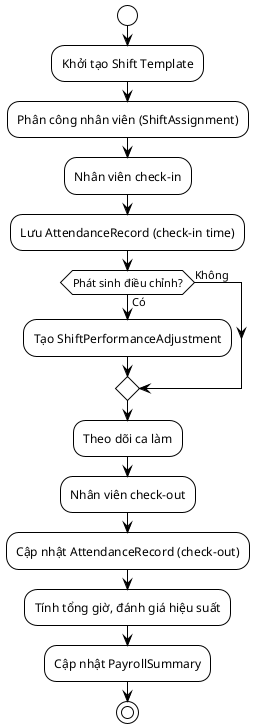

# Sơ Đồ Hoạt Động

## Mục lục
- [1. Giới thiệu](#1-giới-thiệu)
- [2. Quy trình bán hàng tại quầy](#2-quy-trình-bán-hàng-tại-quầy)
- [3. Quy trình quản lý ca làm](#3-quy-trình-quản-lý-ca-làm)
- [4. Ghi chú triển khai](#4-ghi-chú-triển-khai)

## 1. Giới thiệu
Sơ đồ hoạt động mô tả luồng nghiệp vụ quan trọng giúp đội phát triển và vận hành hiểu rõ các bước, điều kiện nhánh và đối tượng tham gia. Các mô tả dưới đây sử dụng PlantUML và phản ánh trạng thái của hệ thống backend.

## 2. Quy trình bán hàng tại quầy
```plantuml
@startuml
!theme plain
start
:Nhân viên đăng nhập (UC-01);
:Chọn bàn, tạo Order PENDING;
:Thêm sản phẩm vào đơn;
if (Có voucher?) then (Có)
  :Gọi VoucherService.validate();
  if (Voucher hợp lệ?) then (Có)
    :Áp dụng giảm giá;
  else (Không)
    :Thông báo lỗi;
    :Điều chỉnh thông tin voucher;
    back to "Thêm sản phẩm vào đơn"
  endif
else (Không)
endif
:Chọn phương thức thanh toán;
:Nhập số tiền khách trả;
if (Số tiền hợp lệ?) then (Có)
  :Cập nhật trạng thái Order = PAID;
  :Giải phóng trạng thái bàn;
  :Ghi nhận Payment & VoucherUsage;
  :In hóa đơn/gửi email (nếu cấu hình);
else (Không)
  :Thông báo lỗi;
  back to "Nhập số tiền khách trả"
endif
stop
@enduml
```

## 3. Quy trình quản lý ca làm


## 4. Ghi chú triển khai
- Các nhánh điều kiện được kiểm soát thông qua service layer (`OrderService`, `ShiftAssignmentService`).
- Hoạt động được bao bọc bởi giao dịch (`@Transactional`) để đảm bảo tính toàn vẹn dữ liệu.
- Sự kiện (ví dụ gửi hóa đơn) có thể chuyển sang xử lý bất đồng bộ bằng message queue.

---
**Mức độ hoàn thiện:** 100%
**Hạng mục còn thiếu:** Không
