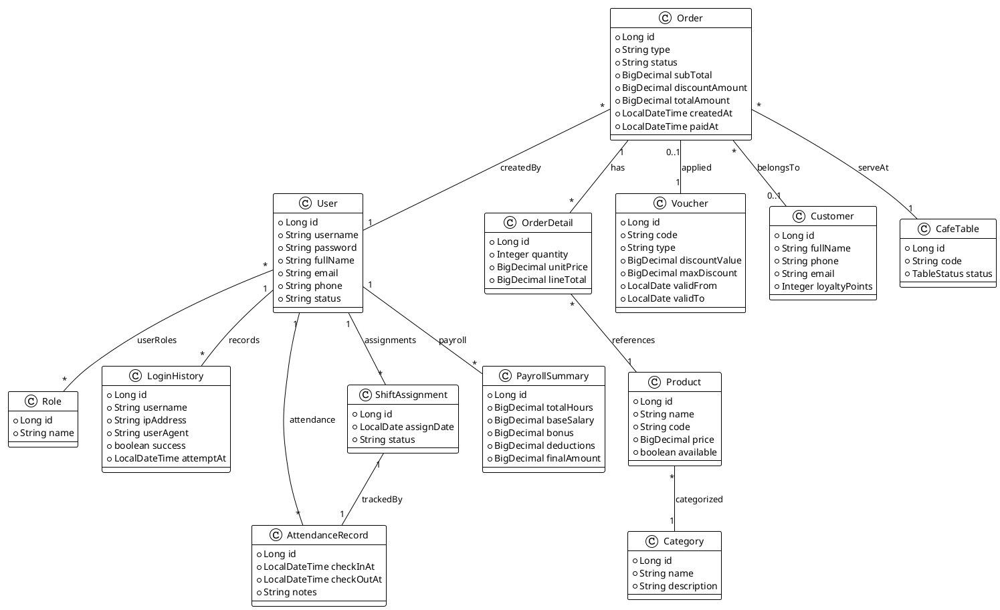

# Sơ Đồ Lớp

## Mục lục
- [1. Tổng quan](#1-tổng-quan)
- [2. PlantUML sơ đồ lớp](#2-plantuml-sơ-đồ-lớp)
- [3. Mối quan hệ chính](#3-mối-quan-hệ-chính)
- [4. Tầng ứng dụng & lớp hỗ trợ](#4-tầng-ứng-dụng--lớp-hỗ-trợ)

## 1. Tổng quan
Sơ đồ lớp mô tả các entity trọng yếu, quan hệ giữa chúng và cách hệ thống tổ chức domain. Kiến trúc tuân theo layered architecture: Controller → Service → Repository → Entity. DTO và Mapper giúp tách payload API khỏi domain.

## 2. PlantUML sơ đồ lớp

## 3. Mối quan hệ chính
- **User ↔ Role**: Quan hệ nhiều-nhiều, ánh xạ qua bảng phụ `user_roles`.
- **Order ↔ OrderDetail ↔ Product**: Diễn tả cấu trúc đơn hàng và chi tiết món, lấy giá sản phẩm tại thời điểm đặt.
- **Order ↔ Voucher**: Mỗi order có thể gắn một voucher, ghi cả `voucherCode` và tham chiếu `Voucher` để truy vết.
- **AttendanceRecord/ShiftAssignment/PayrollSummary**: Bộ ba entity kết nối module nhân sự với bảng lương.
- **LoginHistory**: Lưu mọi lần đăng nhập (thành công/thất bại) phục vụ audit.

## 4. Tầng ứng dụng & lớp hỗ trợ
- **Repository**: Spring Data JPA (`UserRepository`, `OrderRepository`, ...), cung cấp truy vấn chuẩn và custom.
- **Service**: `OrderService`, `VoucherService`, `PayrollService`... triển khai nghiệp vụ và giao dịch.
- **Mapper**: MapStruct (`OrderMapper`, `UserMapper`) chuyển đổi giữa Entity ↔ DTO.
- **DTO**: `OrderResponseDTO`, `CustomerDetailDTO`, `VoucherRequestDTO` mô tả payload API.
- **Validation**: Annotation Jakarta Validation (`@NotNull`, `@Size`, `@Email`, ...), custom validator cho nghiệp vụ.

---
**Mức độ hoàn thiện:** 100%
**Hạng mục còn thiếu:** Không
