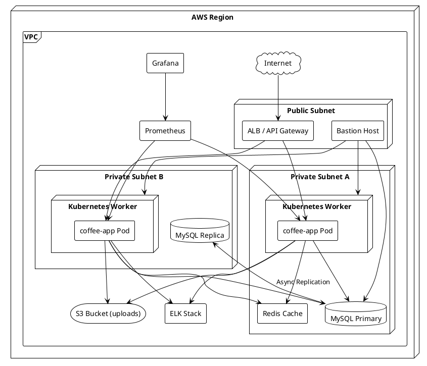

# Sơ Đồ Triển Khai

## Mục lục
- [1. Tổng quan triển khai](#1-tổng-quan-triển-khai)
- [2. Sơ đồ triển khai (PlantUML)](#2-sơ-đồ-triển-khai-plantuml)
- [3. Mô tả thành phần](#3-mô-tả-thành-phần)
- [4. Môi trường triển khai](#4-môi-trường-triển-khai)
- [5. Mạng và bảo mật](#5-mạng-và-bảo-mật)
- [6. Chiến lược mở rộng](#6-chiến-lược-mở-rộng)

## 1. Tổng quan triển khai
Hệ thống được triển khai theo mô hình nhiều tầng: client (POS/web/mobile) → API Gateway → dịch vụ Spring Boot → tầng dữ liệu & dịch vụ hỗ trợ (DB, cache, storage, monitoring). Các node được container hóa bằng Docker, orchestrate bằng Kubernetes (production) hoặc Docker Compose (dev/staging).

## 2. Sơ đồ triển khai (PlantUML)

## 3. Mô tả thành phần
- **ALB/API Gateway**: Phân phối lưu lượng HTTPS, hỗ trợ sticky session dựa trên JWT.
- **Kubernetes Worker**: Chạy pod `coffee-app`, giới hạn CPU/RAM, autoscale HPA dựa trên CPU và request count.
- **MySQL Primary/Replica**: Mô hình master-replica; hệ thống ghi vào Primary, đọc nặng chuyển sang Replica.
- **Redis Cache**: Lưu token, voucher nóng, cấu hình để giảm tải DB.
- **S3 Bucket**: Lưu trữ hình ảnh sản phẩm, hóa đơn PDF.
- **Prometheus/Grafana**: Thu thập và hiển thị metric.
- **ELK (ElasticSearch + Logstash + Kibana)**: Tập trung log ứng dụng, truy vết sự cố.
- **Bastion Host**: Điểm truy cập SSH duy nhất vào nội bộ.

## 4. Môi trường triển khai
| Môi trường | Hạ tầng | Đặc điểm |
|------------|---------|----------|
| Dev | Docker Compose trên máy dev | H2, profile `dev`, bật Swagger |
| Test/Staging | Kubernetes cluster nhỏ (2 node) | Dữ liệu giả lập gần production |
| Production | Kubernetes cluster (≥3 worker) | Autoscaling, multi-AZ, MySQL HA |

## 5. Mạng và bảo mật
- VPC chia 2 subnet private, 1 public; ALB ở public, app/DB ở private.
- Security Group chỉ cho phép HTTP/HTTPS từ Internet tới ALB, SSH từ IP whitelisted tới Bastion.
- Pod giao tiếp với DB qua security group nội bộ, không expose MySQL ra Internet.
- S3 truy cập bằng IAM Role gán cho pod (IRSA).

## 6. Chiến lược mở rộng
- Bật autoscale HPA (Horizontal Pod Autoscaler) khi CPU > 70% trong 5 phút.
- Tách service (Order, Inventory, Reporting) thành microservice nếu QPS > 500.
- Bổ sung Redis cluster và sharding MySQL khi dữ liệu > 500GB.

---
**Mức độ hoàn thiện:** 100%
**Hạng mục còn thiếu:** Không
