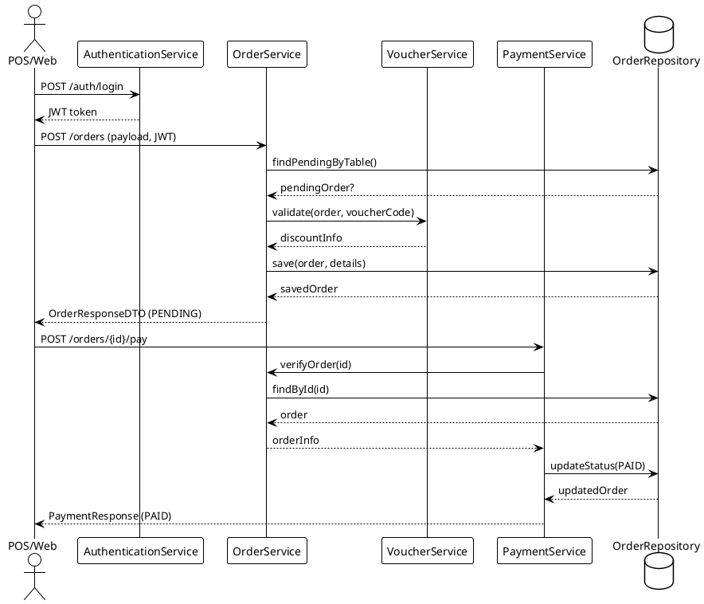
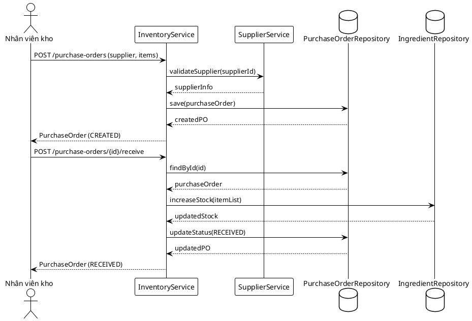
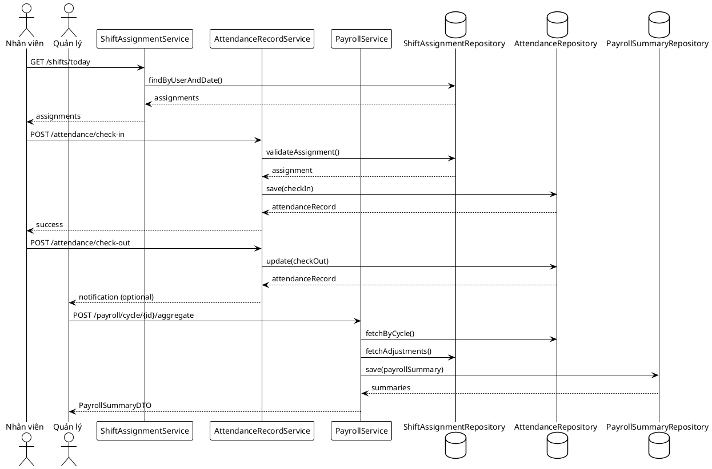

# Sơ Đồ Tuần Tự

## Mục lục
- [1. Giới thiệu](#1-giới-thiệu)
- [2. Đặt hàng và thanh toán tại quầy](#2-đặt-hàng-và-thanh-toán-tại-quầy)
- [3. Quy trình nhập kho](#3-quy-trình-nhập-kho)
- [4. Quy trình chấm công và bảng lương](#4-quy-trình-chấm-công-và-bảng-lương)
- [5. Ghi chú triển khai](#5-ghi-chú-triển-khai)

## 1. Giới thiệu
Sơ đồ tuần tự mô tả tương tác giữa client, service, repository và thành phần phụ trợ trong từng nghiệp vụ trọng điểm. Các sơ đồ sử dụng PlantUML, có thể biên dịch trực tiếp bằng PlantUML hoặc tích hợp CI để xuất hình tự động.

## 2. Đặt hàng và thanh toán tại quầy

## 3. Quy trình nhập kho

## 4. Quy trình chấm công và bảng lương

## 5. Ghi chú triển khai
- Các bước kiểm tra điều kiện (validate supplier, validate assignment) nên throw exception rõ nghĩa để front-end xử lý.
- Sequence diagram hỗ trợ debug và onboarding: xem thêm `thiet-ke-module.md` để biết service nào chịu trách nhiệm.
- Có thể mở rộng diagram cho kịch bản lỗi (ví dụ: thanh toán thất bại, thiếu tồn kho) bằng cách thêm nhánh `alt` trong PlantUML.

---
**Mức độ hoàn thiện:** 100%
**Hạng mục còn thiếu:** Không
