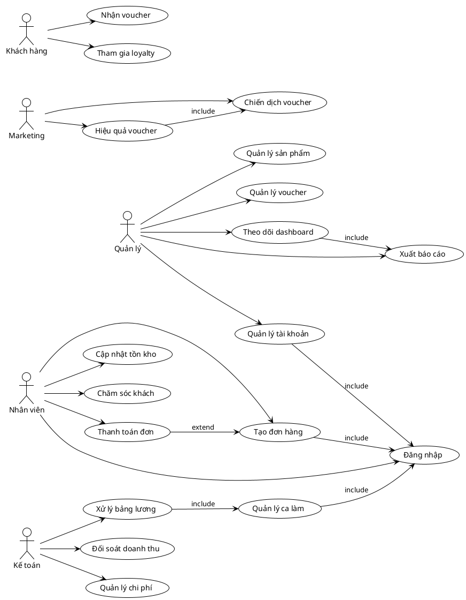

# Sơ Đồ Use Case

## Mục lục
- [1. Giới thiệu](#1-giới-thiệu)
- [2. PlantUML sơ đồ use case](#2-plantuml-sơ-đồ-use-case)
- [3. Mô tả diễn viên](#3-mô-tả-diễn-viên)
- [4. Nhận xét nghiệp vụ](#4-nhận-xét-nghiệp-vụ)

## 1. Giới thiệu
Sơ đồ use case mô tả tương tác giữa các diễn viên chính với hệ thống backend quán cà phê. Sơ đồ giúp xác định phạm vi chức năng, phân bổ trách nhiệm và là cơ sở cho thiết kế chi tiết trong `use-case-chi-tiet.md`.

## 2. PlantUML sơ đồ use case

## 3. Mô tả diễn viên
| Diễn viên | Mô tả |
|-----------|-------|
| Quản lý | Điều phối hoạt động cửa hàng, truy cập báo cáo, cấu hình danh mục, voucher. |
| Nhân viên | Thu ngân/phục vụ, thao tác bán hàng, cập nhật tồn kho, hỗ trợ khách tại quầy. |
| Marketing | Xây dựng chiến dịch khuyến mãi, phân tích hiệu quả voucher. |
| Kế toán | Ghi nhận chi phí, xử lý bảng lương, đối soát doanh thu cuối kỳ. |
| Khách hàng | Nhận voucher, tích điểm loyalty thông qua hệ thống. |

## 4. Nhận xét nghiệp vụ
- Use case "Đăng nhập" là tiền đề cho hầu hết nghiệp vụ nội bộ.
- "Tạo đơn hàng" và "Thanh toán đơn" là luồng chính ảnh hưởng đến báo cáo và tồn kho.
- Module nhân sự liên kết chặt với bảng lương thông qua ca làm.
- Chiến dịch voucher cung cấp dữ liệu cho phân tích hiệu quả marketing.

---
**Mức độ hoàn thiện:** 100%
**Hạng mục còn thiếu:** Không
