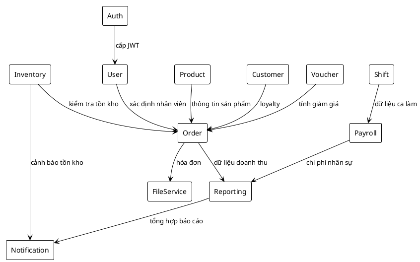

# Thiết Kế Module

## Mục lục
- [1. Tổng quan phân chia module](#1-tổng-quan-phân-chia-module)
- [2. Module Authentication & Authorization](#2-module-authentication--authorization)
- [3. Module User & Role Management](#3-module-user--role-management)
- [4. Module Product & Inventory](#4-module-product--inventory)
- [5. Module Order & Payment](#5-module-order--payment)
- [6. Module Customer & Loyalty](#6-module-customer--loyalty)
- [7. Module Voucher & Promotion](#7-module-voucher--promotion)
- [8. Module Shift & Payroll](#8-module-shift--payroll)
- [9. Module Reporting & Analytics](#9-module-reporting--analytics)
- [10. Module File & Document Service](#10-module-file--document-service)
- [11. Module Notification & Integration](#11-module-notification--integration)
- [12. Quan hệ giữa các module (PlantUML)](#12-quan-hệ-giữa-các-module-plantuml)

## 1. Tổng quan phân chia module
| Module | Chức năng chính | Thành phần chính | Giao tiếp |
|--------|-----------------|------------------|-----------|
| Auth | Đăng nhập, đăng ký, JWT, refresh token | `AuthenticationController`, `AuthenticationService`, `JwtService` | Cung cấp token cho module khác |
| User | Quản lý người dùng, vai trò, phân quyền | `UserController`, `UserService` | Trao đổi với Auth, Order, Shift |
| Product & Inventory | Danh mục, sản phẩm, nguyên liệu, kho | `ProductController`, `IngredientController`, `InventoryService` | Sử dụng trong Order, Reporting |
| Order | Tạo đơn, thanh toán, trạng thái bàn | `OrderController`, `OrderService`, `PaymentService` | Tương tác Product, Voucher, Customer |
| Customer | Quản lý khách, loyalty | `CustomerController`, `CustomerService` | Tích hợp Order, Voucher |
| Voucher | Tạo/áp dụng voucher, chiến dịch | `VoucherController`, `VoucherService` | Sử dụng bởi Order, Customer |
| Shift & Payroll | Ca làm, chấm công, bảng lương | `ShiftController`, `AttendanceService`, `PayrollService` | Liên kết User, Reporting |
| Reporting | Dashboard, báo cáo, export | `ReportController`, `DashboardAnalyticsService` | Đọc dữ liệu Order, Product, Shift |
| File | Upload/download tài liệu | `FileController`, `FileStorageService` | Cung cấp cho Product, Reporting |
| Notification | Gửi email/thông báo nội bộ | `NotificationService` (tùy chọn) | Dùng bởi Order, Payroll |

## 2. Module Authentication & Authorization
- **Trách nhiệm**: cung cấp JWT, quản lý refresh token, ghi lịch sử đăng nhập, giới hạn đăng nhập sai.
- **Luồng chính**: `AuthenticationController` → `AuthenticationService` → `AuthenticationManager` → `JwtService`. Lưu lịch sử qua `LoginHistoryService`.
- **Tích hợp**: Spring Security filter chain (`JwtAuthenticationFilter`), `CustomAccessDeniedHandler`.
- **Database**: `users`, `roles`, `user_roles`, `login_history`.

## 3. Module User & Role Management
- **Trách nhiệm**: CRUD user, gán vai trò, khóa/mở tài khoản, cập nhật thông tin.
- **Service**: `UserService` xử lý logic, `RoleService` (nếu tách rời) quản lý role.
- **API chính**: GET/POST/PUT `/api/v1/users`, PATCH `/api/v1/users/{id}/status`.

## 4. Module Product & Inventory
- **Chức năng**:
  - `ProductService`: quản lý sản phẩm, công thức (`ProductIngredient`), định giá.
  - `IngredientService`: quản lý nguyên liệu, tồn kho.
  - `InventoryService`: điều chỉnh nhập/xuất, kiểm kê, cảnh báo.
- **Các lớp liên quan**: `Product`, `Category`, `Ingredient`, `PurchaseOrder`, `PurchaseOrderDetail`.
- **Integration**: Order Service sử dụng để kiểm tra tồn kho khi tạo đơn.

## 5. Module Order & Payment
- **Chức năng**: tạo đơn (dine-in, takeaway, delivery), cập nhật chi tiết, thanh toán, hủy.
- **Thành phần**: `OrderController`, `OrderService`, `PaymentService`, `OrderMapper`.
- **Luồng dữ liệu**: Order Service gọi Product Repo để xác nhận sản phẩm, Voucher Service để tính giảm giá, Payment Service để ghi nhận thanh toán.

## 6. Module Customer & Loyalty
- **Chức năng**: quản lý hồ sơ khách hàng, điểm tích lũy, phân nhóm, lịch sử mua hàng.
- **Thành phần**: `CustomerController`, `CustomerService`, DTO response (`CustomerDetailDTO`).
- **Tương tác**: Order Service ghi nhận loyalty, Voucher Service cấp voucher theo tier.

## 7. Module Voucher & Promotion
- **Chức năng**: tạo/cập nhật voucher, điều kiện áp dụng, theo dõi lượt sử dụng.
- **Các lớp**: `Voucher`, `VoucherCondition`, `VoucherUsageHistory` (khuyến nghị).
- **Luồng**: `VoucherService.validateVoucher()` được Order gọi khi checkout.

## 8. Module Shift & Payroll
- **Chức năng**: quản lý ca, phân công, chấm công, điều chỉnh hiệu suất, tổng hợp bảng lương.
- **Service**: `ShiftAssignmentService`, `AttendanceRecordService`, `PayrollService`.
- **Entity**: `ShiftTemplate`, `ShiftAssignment`, `ShiftInstance`, `AttendanceRecord`, `PayrollCycle`, `PayrollSummary`.

## 9. Module Reporting & Analytics
- **Chức năng**: thu thập số liệu dashboard, báo cáo doanh thu, top sản phẩm, hiệu suất nhân viên.
- **Thành phần**: `DashboardAnalyticsService`, `ReportController`, DTO `DashboardMetricsDTO`.
- **Tích hợp**: đọc dữ liệu Order, Voucher, Customer, Shift; có thể xuất Excel qua `ReportExcelExporter`.

## 10. Module File & Document Service
- **Chức năng**: upload/download/xóa file (hình ảnh sản phẩm, hóa đơn, chứng từ).
- **Thành phần**: `FileController`, `FileStorageService`, `FileMetadataRepository` (khuyến nghị).
- **Bảo mật**: phân quyền (GET công khai, POST/DELETE yêu cầu Manager/Admin).

## 11. Module Notification & Integration
- **Tùy chọn**: gửi email thông báo (kết quả chốt ca, cảnh báo tồn kho) qua `NotificationService`.
- **Tích hợp ngoài**: webhook đến hệ thống CRM hoặc BI.

## 12. Quan hệ giữa các module (PlantUML)

---
**Mức độ hoàn thiện:** 100%
**Hạng mục còn thiếu:** Không
