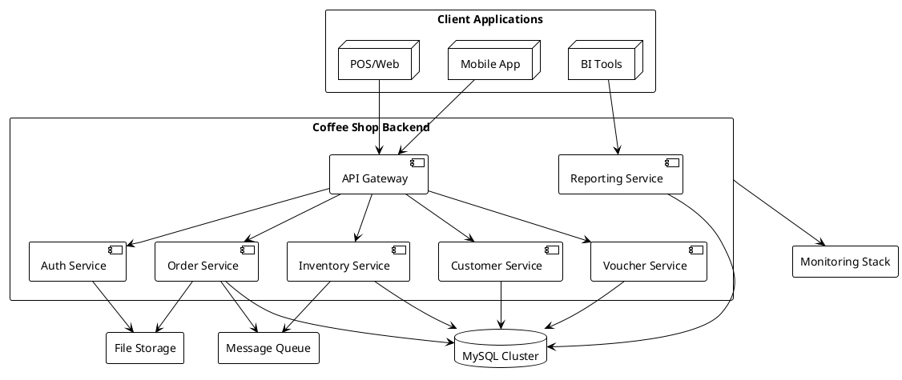

# Tổng Quan Hệ Thống

## Mục lục
- [1. Giới thiệu chung](#1-giới-thiệu-chung)
- [2. Vai trò liên quan](#2-vai-trò-liên-quan)
- [3. Tầm nhìn và mục tiêu chiến lược](#3-tầm-nhìn-và-mục-tiêu-chiến-lược)
- [4. Phạm vi chức năng cốt lõi](#4-phạm-vi-chức-năng-cốt-lõi)
- [5. Công nghệ và kiến trúc nền tảng](#5-công-nghệ-và-kiến-trúc-nền-tảng)
- [6. Lộ trình phát triển sản phẩm](#6-lộ-trình-phát-triển-sản-phẩm)
- [7. Sơ đồ tổng quan cấp cao](#7-sơ-đồ-tổng-quan-cấp-cao)
- [8. Điểm nổi bật & giá trị kinh doanh](#8-điểm-nổi-bật--giá-trị-kinh-doanh)
- [9. Chỉ tiêu KPI chủ đạo](#9-chỉ-tiêu-kpi-chủ-đạo)
- [10. Liên hệ tài liệu liên quan](#10-liên-hệ-tài-liệu-liên-quan)

## 1. Giới thiệu chung
Hệ thống backend quản lý quán cà phê là nền tảng lõi hỗ trợ vận hành toàn diện từ bán hàng, kho vận, nhân sự đến phân tích dữ liệu. Giải pháp xây dựng trên **Java 21** và **Spring Boot 3.5.6**, đảm bảo tốc độ triển khai, độ ổn định và khả năng mở rộng. Các API RESTful được chuẩn hóa giúp dễ dàng tích hợp với POS, web admin, mobile app và hệ thống BI.

## 2. Vai trò liên quan
| Vai trò | Mục tiêu | Kỳ vọng từ hệ thống |
|---------|---------|---------------------|
| Chủ chuỗi/quản lý cấp cao | Theo dõi doanh thu, lợi nhuận, hiệu quả chiến dịch | Dashboard realtime, báo cáo đa chiều |
| Quản lý cửa hàng | Điều phối nhân sự, kiểm soát kho, duy trì chất lượng dịch vụ | Công cụ theo dõi ca làm, cảnh báo tồn kho, báo cáo cuối ca |
| Nhân viên thu ngân/phục vụ | Bán hàng nhanh, ít thao tác | Giao diện POS mượt, xử lý voucher tức thì |
| Bộ phận kho | Quản lý nhập xuất, theo dõi hạn sử dụng | Quy trình nhập kho, kiểm kê, cảnh báo tái đặt hàng |
| Marketing | Tạo chiến dịch, đo hiệu quả | Hệ thống voucher linh hoạt, số liệu phân tích |
| Kế toán/finance | Đối soát doanh thu, chi phí, bảng lương | Báo cáo chuẩn, tích hợp bảng lương |
| Bộ phận kỹ thuật | Triển khai, giám sát, bảo trì | Tài liệu đầy đủ, logging/monitoring chi tiết |

## 3. Tầm nhìn và mục tiêu chiến lược
- **Tầm nhìn**: Trở thành nền tảng vận hành chuẩn hóa cho chuỗi đồ uống quy mô lớn, hỗ trợ ra quyết định dựa trên dữ liệu thời gian thực.
- **Mục tiêu chiến lược**:
  1. Chuẩn hóa quy trình vận hành từ quầy bar đến hậu cần.
  2. Cung cấp số liệu realtime để tối ưu chi phí, tăng doanh thu.
  3. Tạo nền tảng mở để tích hợp với hệ sinh thái đối tác (giao hàng, thanh toán, BI).
  4. Đảm bảo bảo mật dữ liệu khách hàng, tuân thủ quy định pháp lý hiện hành.

## 4. Phạm vi chức năng cốt lõi
- Quản lý danh mục sản phẩm, công thức pha chế, định mức nguyên liệu.
- Quản lý đơn hàng tại chỗ, mang đi, giao hàng, đặt trước.
- Áp dụng voucher, khách hàng thân thiết, chương trình khuyến mãi.
- Theo dõi kho nguyên liệu, nhà cung cấp, đơn mua hàng.
- Tổ chức ca làm việc, chấm công, điều chỉnh hiệu suất, tổng hợp bảng lương.
- Báo cáo doanh thu, chi phí, hiệu suất nhân viên, phân tích hành vi khách hàng.
- Ghi nhận lịch sử đăng nhập, audit thao tác, kiểm soát quyền truy cập.

## 5. Công nghệ và kiến trúc nền tảng
| Thành phần | Công nghệ | Ghi chú |
|------------|-----------|---------|
| Backend Framework | Spring Boot 3.5.6 | Spring MVC, Spring Data JPA, Spring Security |
| Ngôn ngữ | Java 21 | Tận dụng record, pattern matching |
| Cơ sở dữ liệu | MySQL 8.0, H2 (test) | Hỗ trợ replication, flyway migration |
| Authentication | JWT (HS512), Refresh Token | Kết hợp Role/Authority, login history |
| Mapping | MapStruct + Lombok | DTO mapping hiệu quả |
| Documentation | SpringDoc OpenAPI 3 | Swagger UI cho dev/test |
| Reporting | Apache POI | Xuất Excel các báo cáo |
| Deployment | Docker, Docker Compose, Kubernetes mở rộng | CI/CD GitHub Actions |

## 6. Lộ trình phát triển sản phẩm
| Giai đoạn | Trọng tâm | Kết quả mong đợi |
|-----------|-----------|-------------------|
| Giai đoạn 1 | Chuẩn hóa nghiệp vụ bán hàng, kho, nhân sự | Hoàn thiện module order, inventory, payroll |
| Giai đoạn 2 | Phân tích dữ liệu và marketing automation | Dashboard realtime, loyalty tự động |
| Giai đoạn 3 | Mở rộng đa chi nhánh, đa quốc gia | Hỗ trợ multi-tenant, đa ngôn ngữ, đa tiền tệ |
| Giai đoạn 4 | Tối ưu chi phí & AI đề xuất | Machine learning dự báo nhu cầu, chi phí |

## 7. Sơ đồ tổng quan cấp cao

**Mô tả**: Các ứng dụng khách truy cập thông qua API Gateway. Backend tách thành các service theo miền nghiệp vụ, sử dụng cơ sở dữ liệu chung và mở rộng sang kiến trúc sự kiện (message queue) để xử lý bất đồng bộ (ví dụ đồng bộ kho, gửi thông báo).

## 8. Điểm nổi bật & giá trị kinh doanh
- **Chuẩn hóa quy trình**: Giảm sai sót vận hành nhờ quy trình số hóa thống nhất.
- **Quyết định dựa trên dữ liệu**: Dashboard realtime giúp tối ưu giờ cao điểm, chiến dịch voucher.
- **Khả năng mở rộng**: Thiết kế module hóa, sẵn sàng tách microservice khi lưu lượng tăng.
- **Bảo mật & tuân thủ**: Theo dõi login, audit, phân quyền chi tiết, sẵn sàng đáp ứng kiểm toán nội bộ.
- **Tích hợp linh hoạt**: API rõ ràng, sử dụng chuẩn REST, tài liệu đầy đủ cho đối tác bên ngoài.

## 9. Chỉ tiêu KPI chủ đạo
| Nhóm KPI | Chỉ số | Mục tiêu |
|----------|--------|----------|
| Vận hành | Thời gian xử lý đơn tại quầy | < 120 giây |
| Kinh doanh | Tỷ lệ khách hàng quay lại | +15% sau 6 tháng |
| Kho vận | Sai lệch tồn kho | < 3% |
| Nhân sự | Thời gian chốt ca cuối ngày | < 10 phút |
| IT | Uptime giờ hoạt động | ≥ 99% |

## 10. Liên hệ tài liệu liên quan
- **Phạm vi hệ thống**: xem `pham-vi.md`.
- **Kiến trúc chi tiết**: tham khảo `kien-truc-tong-the.md` và `thiet-ke-module.md`.
- **Quy trình xử lý**: xem `quy-trinh-xu-ly.md` và sơ đồ tương ứng.
- **KPI và phân tích hiệu năng**: tham khảo `phan-tich-hieu-nang.md`.

---
**Mức độ hoàn thiện:** 100%
**Hạng mục còn thiếu:** Không
